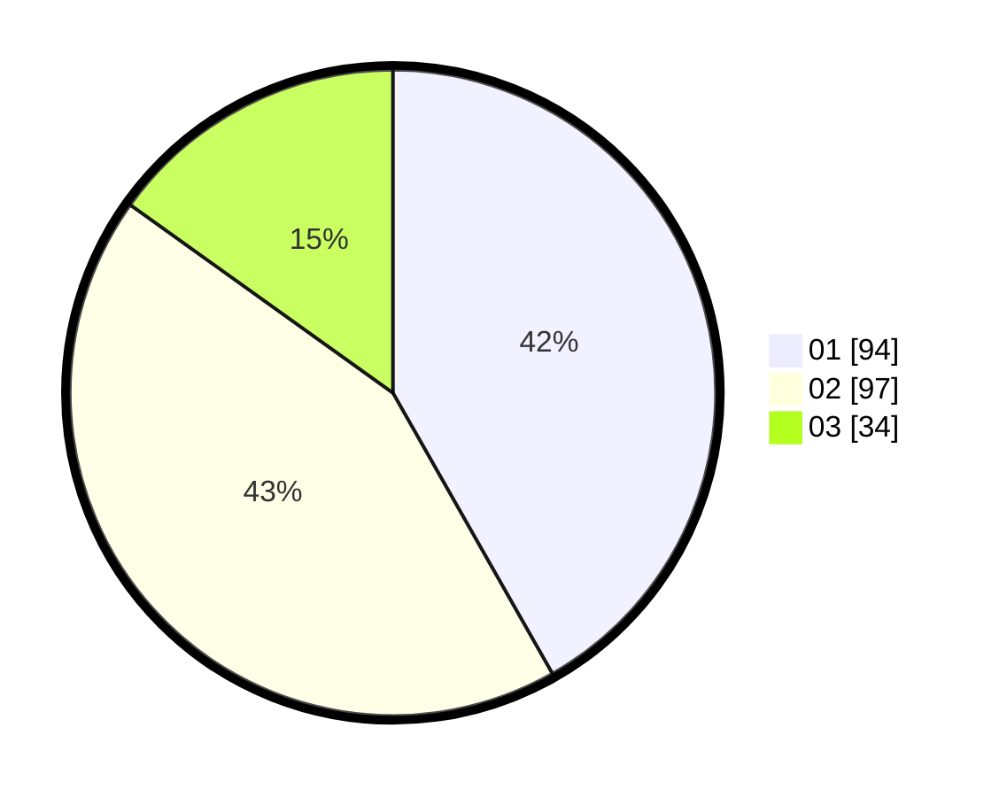

# Hasil

Hasil perolehan suara paslon dapat dilihat pada file paslon-01.txt, paslon-02.txt, dan paslon-03.txt.

Jika tidak ada, artinya data tersebut belum ada pada SIREKAP.

## Perolehan Suara

 * Paslon 01: **94**.
 * Paslon 02: **97**.
 * Paslon 03: **34**.

## Foto C Plano

https://sirekap-obj-formc.kpu.go.id/d2d9/pemilu/ppwp/31/74/10/10/04/3174101004060-20240214-190045--06968d98-3955-4040-bda8-b57d110c9bc4.jpg

https://sirekap-obj-formc.kpu.go.id/d2d9/pemilu/ppwp/31/74/10/10/04/3174101004060-20240214-192015--62cb5bd0-2b9f-40a6-98b2-93f1f0a5e012.jpg

https://sirekap-obj-formc.kpu.go.id/d2d9/pemilu/ppwp/31/74/10/10/04/3174101004060-20240214-191522--52ad2021-565d-41df-9a19-88b5728ae0c8.jpg

## DATA PEMILIH TETAP

Jumlah pemilih dalam DPT: **275**.
 * L: **145**.
 * P: **130**.

## DATA PENGGUNA HAK PILIH

Jumlah pengguna hak pilih dalam DPT: **226**.
 * L: **119**.
 * P: **107**.

Jumlah pengguna hak pilih dalam DPTb: **0**.
 * L: **0**.
 * P: **0**.

Jumlah pengguna hak pilih dalam DPK: **1**.
 * L: **0**.
 * P: **1**.

Jumlah pengguna hak pilih: **227**.
 * L: **119**.
 * P: **108**.

## JUMLAH SUARA SAH DAN TIDAK SAH

JUMLAH SELURUH SUARA SAH: **225**.

JUMLAH SUARA TIDAK SAH: **2**.

JUMLAH SELURUH SUARA SAH DAN SUARA TIDAK SAH: **227**.
