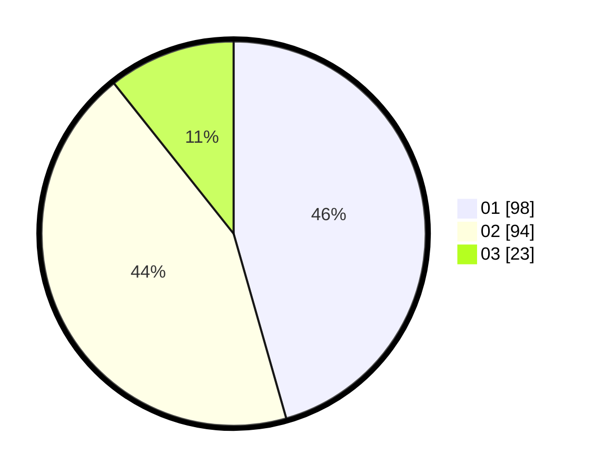

# Hasil

Hasil perolehan suara paslon dapat dilihat pada file paslon-01.txt, paslon-02.txt, dan paslon-03.txt.

Jika tidak ada, artinya data tersebut belum ada pada SIREKAP.

## Perolehan Suara

 * Paslon 01: **98**.
 * Paslon 02: **94**.
 * Paslon 03: **23**.

## Foto C Plano

https://sirekap-obj-formc.kpu.go.id/f960/pemilu/ppwp/31/74/10/10/04/3174101004061-20240214-225453--37f3d277-2aec-4790-8d0c-799fff35e546.jpg

https://sirekap-obj-formc.kpu.go.id/f960/pemilu/ppwp/31/74/10/10/04/3174101004061-20240214-225529--c2cf76a2-93cc-4a94-a967-586bd8d91835.jpg

https://sirekap-obj-formc.kpu.go.id/f960/pemilu/ppwp/31/74/10/10/04/3174101004061-20240214-225540--ff2562b0-f779-467e-bed4-f95be72f378a.jpg

## DATA PEMILIH TETAP

Jumlah pemilih dalam DPT: **272**.
 * L: **131**.
 * P: **141**.

## DATA PENGGUNA HAK PILIH

Jumlah pengguna hak pilih dalam DPT: **209**.
 * L: **96**.
 * P: **113**.

Jumlah pengguna hak pilih dalam DPTb: **2**.
 * L: **2**.
 * P: **0**.

Jumlah pengguna hak pilih dalam DPK: **9**.
 * L: **3**.
 * P: **6**.

Jumlah pengguna hak pilih: **220**.
 * L: **101**.
 * P: **119**.

## JUMLAH SUARA SAH DAN TIDAK SAH

JUMLAH SELURUH SUARA SAH: **215**.

JUMLAH SUARA TIDAK SAH: **5**.

JUMLAH SELURUH SUARA SAH DAN SUARA TIDAK SAH: **220**.
