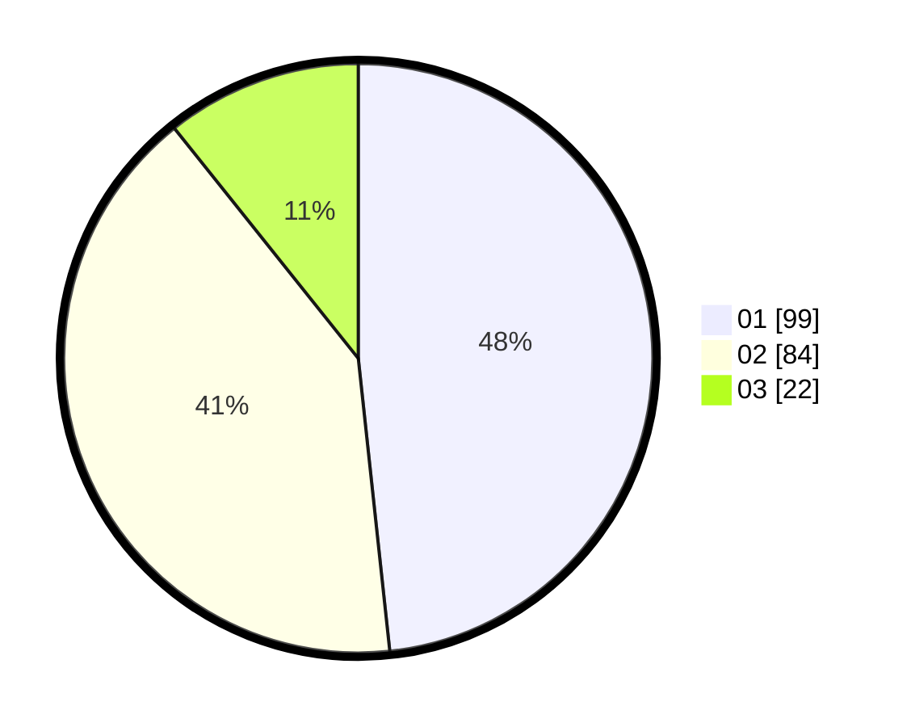

# Hasil

Hasil perolehan suara paslon dapat dilihat pada file paslon-01.txt, paslon-02.txt, dan paslon-03.txt.

Jika tidak ada, artinya data tersebut belum ada pada SIREKAP.

## Perolehan Suara

 * Paslon 01: **99**.
 * Paslon 02: **84**.
 * Paslon 03: **22**.

## Foto C Plano

https://sirekap-obj-formc.kpu.go.id/1db4/pemilu/ppwp/31/74/10/10/04/3174101004098-20240214-225528--75fd19f9-2baf-40f2-8651-a2c830a07726.jpg

https://sirekap-obj-formc.kpu.go.id/1db4/pemilu/ppwp/31/74/10/10/04/3174101004098-20240214-225636--615ab43c-a3c0-439f-b229-c2e9e52261a1.jpg

https://sirekap-obj-formc.kpu.go.id/1db4/pemilu/ppwp/31/74/10/10/04/3174101004098-20240214-225744--9877dac9-94fb-4b6a-81f5-2c2b8dcc018e.jpg

## DATA PEMILIH TETAP

Jumlah pemilih dalam DPT: **276**.
 * L: **135**.
 * P: **141**.

## DATA PENGGUNA HAK PILIH

Jumlah pengguna hak pilih dalam DPT: **204**.
 * L: **93**.
 * P: **111**.

Jumlah pengguna hak pilih dalam DPTb: **0**.
 * L: **0**.
 * P: **0**.

Jumlah pengguna hak pilih dalam DPK: **2**.
 * L: **0**.
 * P: **2**.

Jumlah pengguna hak pilih: **206**.
 * L: **93**.
 * P: **113**.

## JUMLAH SUARA SAH DAN TIDAK SAH

JUMLAH SELURUH SUARA SAH: **205**.

JUMLAH SUARA TIDAK SAH: **1**.

JUMLAH SELURUH SUARA SAH DAN SUARA TIDAK SAH: **206**.
