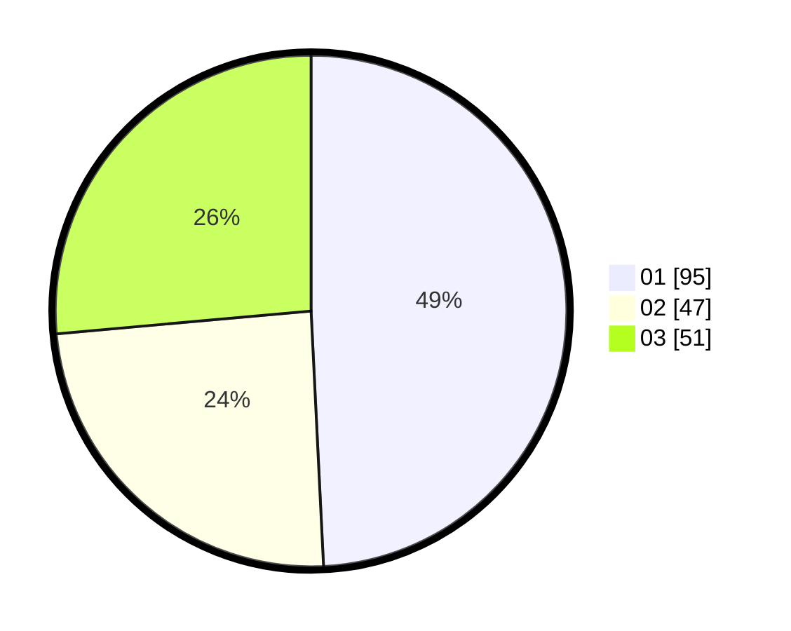

# Hasil

Hasil perolehan suara paslon dapat dilihat pada file paslon-01.txt, paslon-02.txt, dan paslon-03.txt.

Jika tidak ada, artinya data tersebut belum ada pada SIREKAP.

## Perolehan Suara

 * Paslon 01: **95**.
 * Paslon 02: **47**.
 * Paslon 03: **51**.

## Foto C Plano

https://sirekap-obj-formc.kpu.go.id/08bb/pemilu/ppwp/31/74/10/10/04/3174101004126-20240214-202852--0024a86f-5418-4fe9-88fc-4106ef32cd5c.jpg

https://sirekap-obj-formc.kpu.go.id/08bb/pemilu/ppwp/31/74/10/10/04/3174101004126-20240214-202928--6d106bcc-5e41-494d-8f7b-676e6abbb819.jpg

https://sirekap-obj-formc.kpu.go.id/08bb/pemilu/ppwp/31/74/10/10/04/3174101004126-20240214-203008--73eb3795-db2c-4681-b7ca-9df8a5ec5053.jpg

## DATA PEMILIH TETAP

Jumlah pemilih dalam DPT: **233**.
 * L: **109**.
 * P: **124**.

## DATA PENGGUNA HAK PILIH

Jumlah pengguna hak pilih dalam DPT: **192**.
 * L: **87**.
 * P: **105**.

Jumlah pengguna hak pilih dalam DPTb: **2**.
 * L: **1**.
 * P: **1**.

Jumlah pengguna hak pilih dalam DPK: **3**.
 * L: **3**.
 * P: **0**.

Jumlah pengguna hak pilih: **197**.
 * L: **91**.
 * P: **106**.

## JUMLAH SUARA SAH DAN TIDAK SAH

JUMLAH SELURUH SUARA SAH: **193**.

JUMLAH SUARA TIDAK SAH: **4**.

JUMLAH SELURUH SUARA SAH DAN SUARA TIDAK SAH: **197**.
