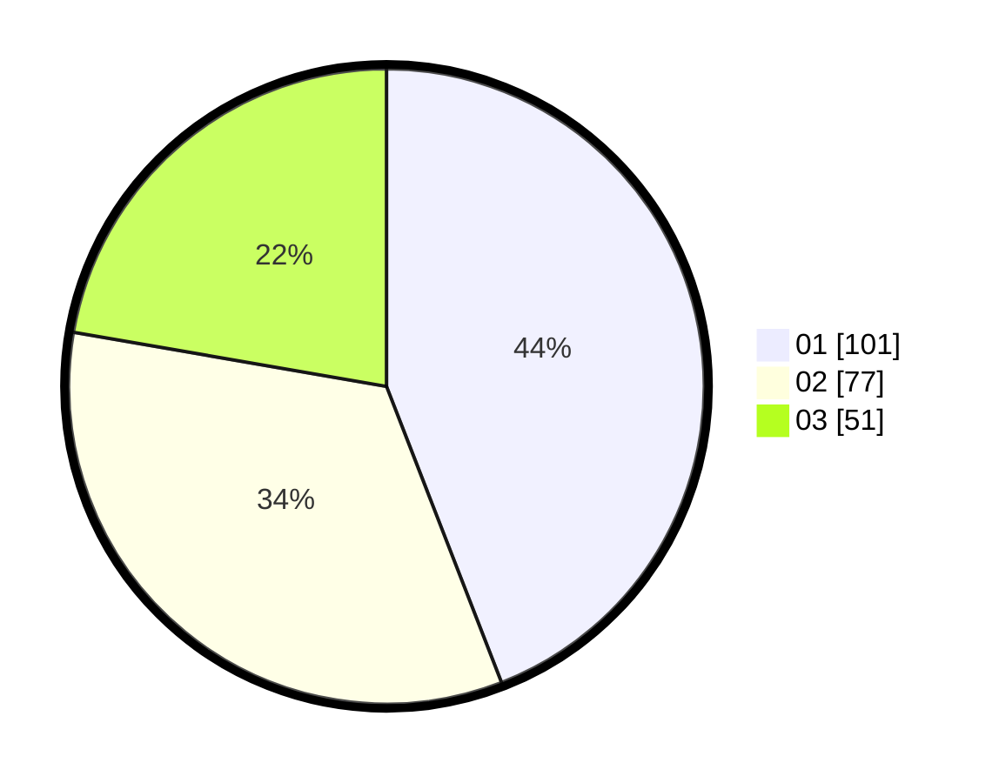

# Hasil

Hasil perolehan suara paslon dapat dilihat pada file paslon-01.txt, paslon-02.txt, dan paslon-03.txt.

Jika tidak ada, artinya data tersebut belum ada pada SIREKAP.

## Perolehan Suara

 * Paslon 01: **101**.
 * Paslon 02: **77**.
 * Paslon 03: **51**.

## Foto C Plano

https://sirekap-obj-formc.kpu.go.id/352f/pemilu/ppwp/31/74/10/10/05/3174101005001-20240214-193821--ffd6af0f-3d75-4882-beca-cfe89c53ab17.jpg

https://sirekap-obj-formc.kpu.go.id/352f/pemilu/ppwp/31/74/10/10/05/3174101005001-20240214-194024--0e31c6ea-0488-4ca1-a285-987f5a53e454.jpg

https://sirekap-obj-formc.kpu.go.id/352f/pemilu/ppwp/31/74/10/10/05/3174101005001-20240214-194134--45a04fdb-6607-401d-af15-99ed88a84d48.jpg

## DATA PEMILIH TETAP

Jumlah pemilih dalam DPT: **268**.
 * L: **134**.
 * P: **134**.

## DATA PENGGUNA HAK PILIH

Jumlah pengguna hak pilih dalam DPT: **232**.
 * L: **114**.
 * P: **118**.

Jumlah pengguna hak pilih dalam DPTb: **2**.
 * L: **0**.
 * P: **2**.

Jumlah pengguna hak pilih dalam DPK: **0**.
 * L: **0**.
 * P: **0**.

Jumlah pengguna hak pilih: **234**.
 * L: **114**.
 * P: **120**.

## JUMLAH SUARA SAH DAN TIDAK SAH

JUMLAH SELURUH SUARA SAH: **229**.

JUMLAH SUARA TIDAK SAH: **5**.

JUMLAH SELURUH SUARA SAH DAN SUARA TIDAK SAH: **234**.
