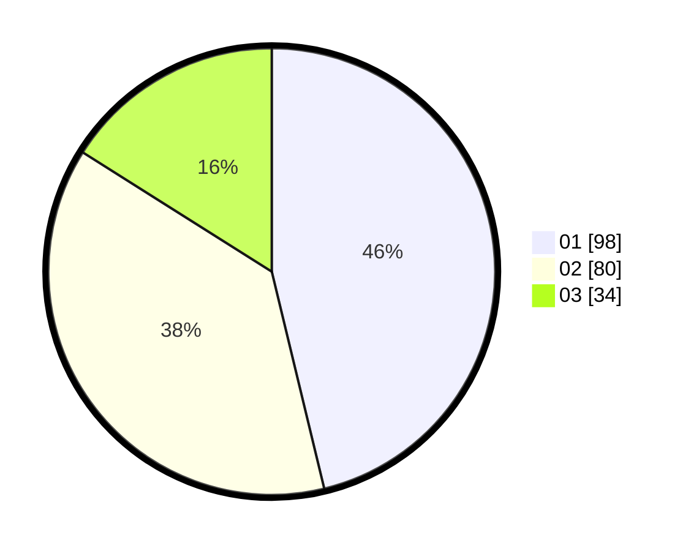

# Hasil

Hasil perolehan suara paslon dapat dilihat pada file paslon-01.txt, paslon-02.txt, dan paslon-03.txt.

Jika tidak ada, artinya data tersebut belum ada pada SIREKAP.

## Perolehan Suara

 * Paslon 01: **98**.
 * Paslon 02: **80**.
 * Paslon 03: **34**.

## Foto C Plano

https://sirekap-obj-formc.kpu.go.id/15c1/pemilu/ppwp/31/74/10/10/05/3174101005002-20240218-180413--0005b232-9832-497e-b9fd-c8e21d3b0180.jpg

https://sirekap-obj-formc.kpu.go.id/15c1/pemilu/ppwp/31/74/10/10/05/3174101005002-20240218-180414--b26733ea-1a3d-4102-8549-4098c092d734.jpg

https://sirekap-obj-formc.kpu.go.id/15c1/pemilu/ppwp/31/74/10/10/05/3174101005002-20240218-180414--7b8296ff-fc37-41e8-8c7c-b4c1801b642a.jpg

## DATA PEMILIH TETAP

Jumlah pemilih dalam DPT: **267**.
 * L: **134**.
 * P: **133**.

## DATA PENGGUNA HAK PILIH

Jumlah pengguna hak pilih dalam DPT: **212**.
 * L: **112**.
 * P: **100**.

Jumlah pengguna hak pilih dalam DPTb: **3**.
 * L: **1**.
 * P: **2**.

Jumlah pengguna hak pilih dalam DPK: **0**.
 * L: **0**.
 * P: **0**.

Jumlah pengguna hak pilih: **215**.
 * L: **113**.
 * P: **102**.

## JUMLAH SUARA SAH DAN TIDAK SAH

JUMLAH SELURUH SUARA SAH: **212**.

JUMLAH SUARA TIDAK SAH: **3**.

JUMLAH SELURUH SUARA SAH DAN SUARA TIDAK SAH: **215**.
