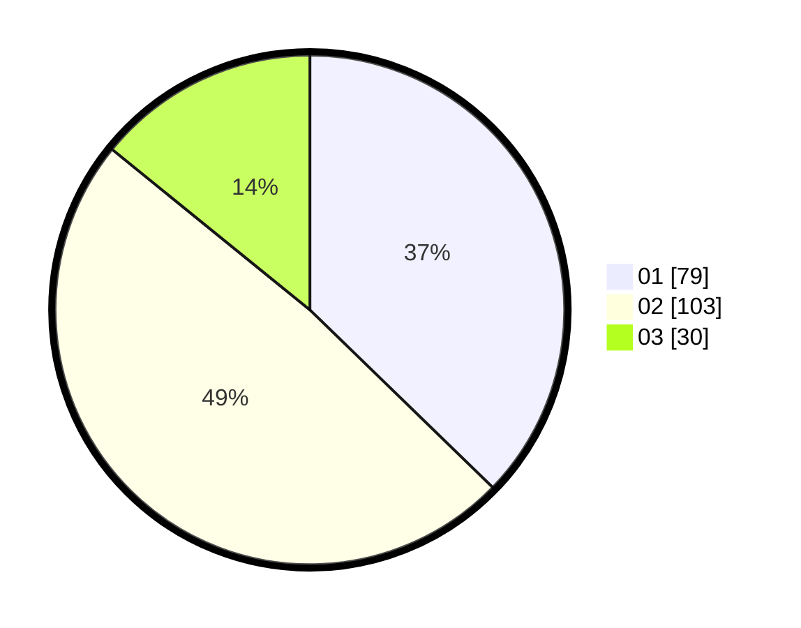

# Hasil

Hasil perolehan suara paslon dapat dilihat pada file paslon-01.txt, paslon-02.txt, dan paslon-03.txt.

Jika tidak ada, artinya data tersebut belum ada pada SIREKAP.

## Perolehan Suara

 * Paslon 01: **79**.
 * Paslon 02: **103**.
 * Paslon 03: **30**.

## Foto C Plano

https://sirekap-obj-formc.kpu.go.id/9f56/pemilu/ppwp/31/74/10/10/05/3174101005010-20240218-224928--dd38b103-0bff-4224-912f-72cc4038d7e2.jpg

https://sirekap-obj-formc.kpu.go.id/9f56/pemilu/ppwp/31/74/10/10/05/3174101005010-20240218-224929--35e8b917-e3eb-41b1-bf02-bb385d1275db.jpg

https://sirekap-obj-formc.kpu.go.id/9f56/pemilu/ppwp/31/74/10/10/05/3174101005010-20240218-224928--b7d560ab-2a43-4d4d-8200-292f62ed27ae.jpg

## DATA PEMILIH TETAP

Jumlah pemilih dalam DPT: **278**.
 * L: **130**.
 * P: **148**.

## DATA PENGGUNA HAK PILIH

Jumlah pengguna hak pilih dalam DPT: **214**.
 * L: **99**.
 * P: **115**.

Jumlah pengguna hak pilih dalam DPTb: **0**.
 * L: **0**.
 * P: **0**.

Jumlah pengguna hak pilih dalam DPK: **2**.
 * L: **1**.
 * P: **1**.

Jumlah pengguna hak pilih: **216**.
 * L: **100**.
 * P: **116**.

## JUMLAH SUARA SAH DAN TIDAK SAH

JUMLAH SELURUH SUARA SAH: **212**.

JUMLAH SUARA TIDAK SAH: **4**.

JUMLAH SELURUH SUARA SAH DAN SUARA TIDAK SAH: **216**.
