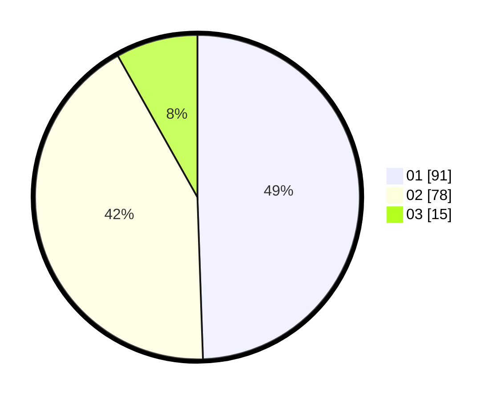

# Hasil

Hasil perolehan suara paslon dapat dilihat pada file paslon-01.txt, paslon-02.txt, dan paslon-03.txt.

Jika tidak ada, artinya data tersebut belum ada pada SIREKAP.

## Perolehan Suara

 * Paslon 01: **91**.
 * Paslon 02: **78**.
 * Paslon 03: **15**.

## Foto C Plano

https://sirekap-obj-formc.kpu.go.id/3a25/pemilu/ppwp/31/74/10/10/05/3174101005012-20240218-203316--f31446bc-8e32-487d-83c6-422a0f8df769.jpg

https://sirekap-obj-formc.kpu.go.id/3a25/pemilu/ppwp/31/74/10/10/05/3174101005012-20240218-203317--0a924776-7431-40c2-872d-537002c2e474.jpg

https://sirekap-obj-formc.kpu.go.id/3a25/pemilu/ppwp/31/74/10/10/05/3174101005012-20240218-203316--0a4f0c9b-401a-4048-a3f2-a7836f8ab385.jpg

## DATA PEMILIH TETAP

Jumlah pemilih dalam DPT: **225**.
 * L: **105**.
 * P: **120**.

## DATA PENGGUNA HAK PILIH

Jumlah pengguna hak pilih dalam DPT: **185**.
 * L: **86**.
 * P: **99**.

Jumlah pengguna hak pilih dalam DPTb: **0**.
 * L: **0**.
 * P: **0**.

Jumlah pengguna hak pilih dalam DPK: **0**.
 * L: **0**.
 * P: **0**.

Jumlah pengguna hak pilih: **185**.
 * L: **86**.
 * P: **99**.

## JUMLAH SUARA SAH DAN TIDAK SAH

JUMLAH SELURUH SUARA SAH: **184**.

JUMLAH SUARA TIDAK SAH: **1**.

JUMLAH SELURUH SUARA SAH DAN SUARA TIDAK SAH: **185**.
