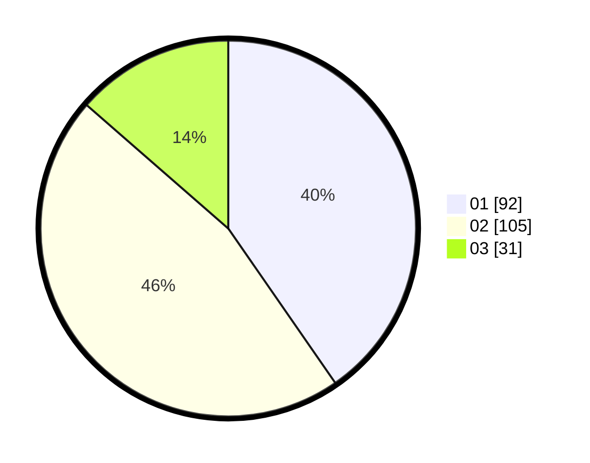

# Hasil

Hasil perolehan suara paslon dapat dilihat pada file paslon-01.txt, paslon-02.txt, dan paslon-03.txt.

Jika tidak ada, artinya data tersebut belum ada pada SIREKAP.

## Perolehan Suara

 * Paslon 01: **92**.
 * Paslon 02: **105**.
 * Paslon 03: **31**.

## Foto C Plano

https://sirekap-obj-formc.kpu.go.id/653f/pemilu/ppwp/31/74/10/10/05/3174101005014-20240216-201146--425eaca7-76e7-4075-8fad-b6c9cd2fb4c6.jpg

https://sirekap-obj-formc.kpu.go.id/653f/pemilu/ppwp/31/74/10/10/05/3174101005014-20240216-202901--7b826325-361a-4e2b-9eaf-eac7101542e0.jpg

https://sirekap-obj-formc.kpu.go.id/653f/pemilu/ppwp/31/74/10/10/05/3174101005014-20240216-203512--2d02fc51-cb83-4182-bc49-bc05b38c8642.jpg

## DATA PEMILIH TETAP

Jumlah pemilih dalam DPT: **251**.
 * L: **131**.
 * P: **120**.

## DATA PENGGUNA HAK PILIH

Jumlah pengguna hak pilih dalam DPT: **226**.
 * L: **114**.
 * P: **112**.

Jumlah pengguna hak pilih dalam DPTb: **2**.
 * L: **1**.
 * P: **1**.

Jumlah pengguna hak pilih dalam DPK: **3**.
 * L: **1**.
 * P: **2**.

Jumlah pengguna hak pilih: **231**.
 * L: **116**.
 * P: **115**.

## JUMLAH SUARA SAH DAN TIDAK SAH

JUMLAH SELURUH SUARA SAH: **228**.

JUMLAH SUARA TIDAK SAH: **3**.

JUMLAH SELURUH SUARA SAH DAN SUARA TIDAK SAH: **231**.
