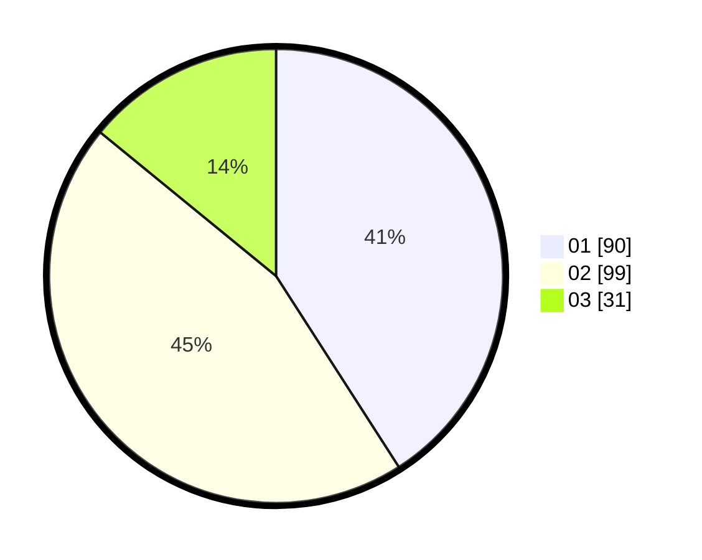

# Hasil

Hasil perolehan suara paslon dapat dilihat pada file paslon-01.txt, paslon-02.txt, dan paslon-03.txt.

Jika tidak ada, artinya data tersebut belum ada pada SIREKAP.

## Perolehan Suara

 * Paslon 01: **90**.
 * Paslon 02: **99**.
 * Paslon 03: **31**.

## Foto C Plano

https://sirekap-obj-formc.kpu.go.id/6508/pemilu/ppwp/31/74/10/10/05/3174101005015-20240218-201718--c47efd27-acd4-4734-a57e-d0f6147ba4bf.jpg

https://sirekap-obj-formc.kpu.go.id/6508/pemilu/ppwp/31/74/10/10/05/3174101005015-20240218-201720--4f2a563e-07db-44df-b947-c373bea8251d.jpg

https://sirekap-obj-formc.kpu.go.id/6508/pemilu/ppwp/31/74/10/10/05/3174101005015-20240218-201719--937c5bd5-cfd3-4245-be81-337e34aaca79.jpg

## DATA PEMILIH TETAP

Jumlah pemilih dalam DPT: **278**.
 * L: **139**.
 * P: **139**.

## DATA PENGGUNA HAK PILIH

Jumlah pengguna hak pilih dalam DPT: **229**.
 * L: **110**.
 * P: **119**.

Jumlah pengguna hak pilih dalam DPTb: **0**.
 * L: **0**.
 * P: **0**.

Jumlah pengguna hak pilih dalam DPK: **0**.
 * L: **0**.
 * P: **0**.

Jumlah pengguna hak pilih: **229**.
 * L: **110**.
 * P: **119**.

## JUMLAH SUARA SAH DAN TIDAK SAH

JUMLAH SELURUH SUARA SAH: **220**.

JUMLAH SUARA TIDAK SAH: **9**.

JUMLAH SELURUH SUARA SAH DAN SUARA TIDAK SAH: **229**.
