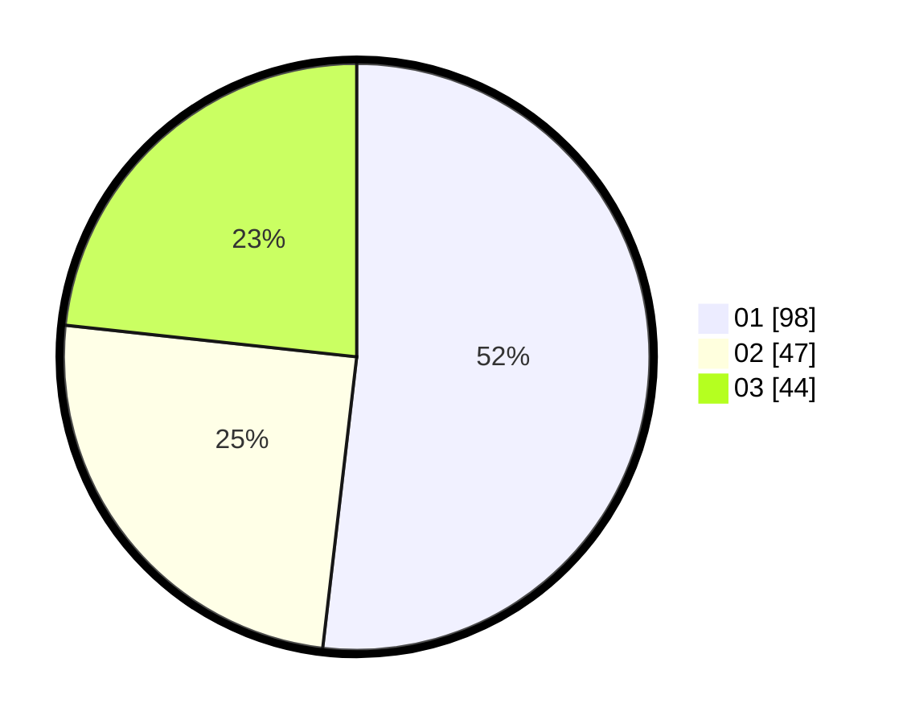

# Hasil

Hasil perolehan suara paslon dapat dilihat pada file paslon-01.txt, paslon-02.txt, dan paslon-03.txt.

Jika tidak ada, artinya data tersebut belum ada pada SIREKAP.

## Perolehan Suara

 * Paslon 01: **98**.
 * Paslon 02: **47**.
 * Paslon 03: **44**.

## Foto C Plano

https://sirekap-obj-formc.kpu.go.id/fc75/pemilu/ppwp/31/74/10/10/05/3174101005018-20240215-234848--a069b2d5-5574-4b95-a74e-7aaded07df24.jpg

https://sirekap-obj-formc.kpu.go.id/fc75/pemilu/ppwp/31/74/10/10/05/3174101005018-20240215-234850--acdc8384-5346-4ce8-bb2d-228a93fb6e2b.jpg

https://sirekap-obj-formc.kpu.go.id/fc75/pemilu/ppwp/31/74/10/10/05/3174101005018-20240215-234849--88182ff2-2beb-433e-b859-030e71d0f274.jpg

## DATA PEMILIH TETAP

Jumlah pemilih dalam DPT: **231**.
 * L: **114**.
 * P: **117**.

## DATA PENGGUNA HAK PILIH

Jumlah pengguna hak pilih dalam DPT: **177**.
 * L: **83**.
 * P: **94**.

Jumlah pengguna hak pilih dalam DPTb: **12**.
 * L: **2**.
 * P: **10**.

Jumlah pengguna hak pilih dalam DPK: **1**.
 * L: **1**.
 * P: **0**.

Jumlah pengguna hak pilih: **190**.
 * L: **86**.
 * P: **104**.

## JUMLAH SUARA SAH DAN TIDAK SAH

JUMLAH SELURUH SUARA SAH: **189**.

JUMLAH SUARA TIDAK SAH: **1**.

JUMLAH SELURUH SUARA SAH DAN SUARA TIDAK SAH: **190**.
