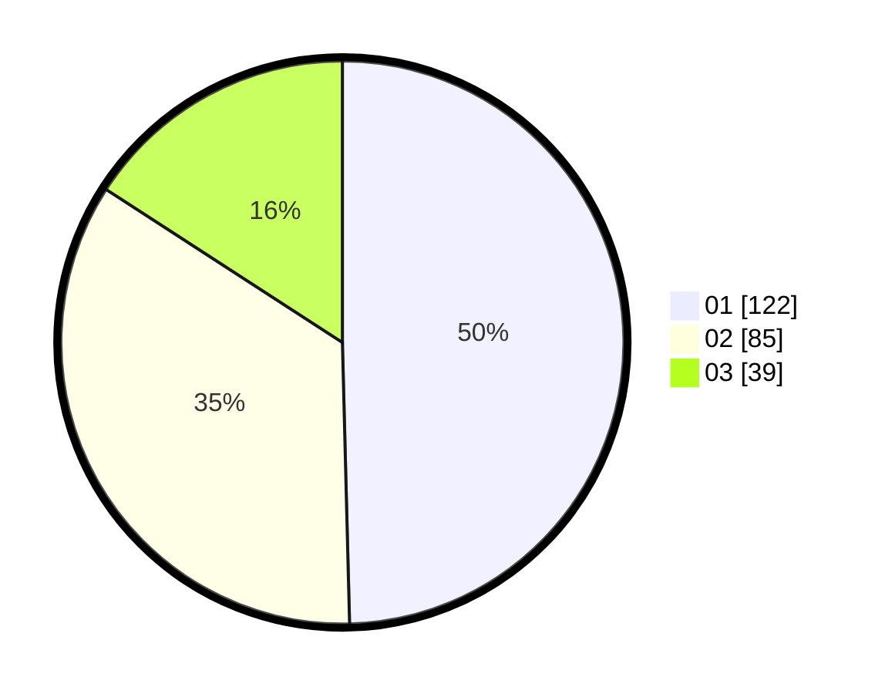

# Hasil

Hasil perolehan suara paslon dapat dilihat pada file paslon-01.txt, paslon-02.txt, dan paslon-03.txt.

Jika tidak ada, artinya data tersebut belum ada pada SIREKAP.

## Perolehan Suara

 * Paslon 01: **122**.
 * Paslon 02: **85**.
 * Paslon 03: **39**.

## Foto C Plano

https://sirekap-obj-formc.kpu.go.id/5ae9/pemilu/ppwp/31/74/10/10/05/3174101005023-20240216-223036--84e8144a-57fa-4c32-a434-73ba0e79de25.jpg

https://sirekap-obj-formc.kpu.go.id/5ae9/pemilu/ppwp/31/74/10/10/05/3174101005023-20240216-223038--72e39db5-6ef1-483c-8a27-9e5745c9aedb.jpg

https://sirekap-obj-formc.kpu.go.id/5ae9/pemilu/ppwp/31/74/10/10/05/3174101005023-20240216-223037--bfef3851-dbee-4f9a-b6ff-a304e8dc49bf.jpg

## DATA PEMILIH TETAP

Jumlah pemilih dalam DPT: **279**.
 * L: **131**.
 * P: **148**.

## DATA PENGGUNA HAK PILIH

Jumlah pengguna hak pilih dalam DPT: **233**.
 * L: **101**.
 * P: **132**.

Jumlah pengguna hak pilih dalam DPTb: **15**.
 * L: **1**.
 * P: **14**.

Jumlah pengguna hak pilih dalam DPK: **2**.
 * L: **2**.
 * P: **0**.

Jumlah pengguna hak pilih: **250**.
 * L: **104**.
 * P: **146**.

## JUMLAH SUARA SAH DAN TIDAK SAH

JUMLAH SELURUH SUARA SAH: **246**.

JUMLAH SUARA TIDAK SAH: **4**.

JUMLAH SELURUH SUARA SAH DAN SUARA TIDAK SAH: **250**.
