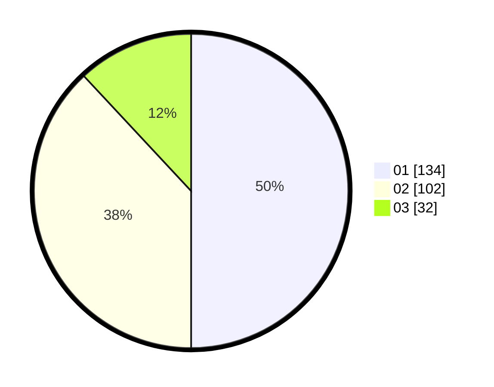

# Hasil

Hasil perolehan suara paslon dapat dilihat pada file paslon-01.txt, paslon-02.txt, dan paslon-03.txt.

Jika tidak ada, artinya data tersebut belum ada pada SIREKAP.

## Perolehan Suara

 * Paslon 01: **134**.
 * Paslon 02: **102**.
 * Paslon 03: **32**.

## Foto C Plano

https://sirekap-obj-formc.kpu.go.id/d77f/pemilu/ppwp/31/74/10/10/05/3174101005025-20240216-133533--2625dc0e-c595-4b06-97e4-c26fb315deac.jpg

https://sirekap-obj-formc.kpu.go.id/d77f/pemilu/ppwp/31/74/10/10/05/3174101005025-20240216-133534--71edda63-0a5b-4fb5-b2da-05694c92120c.jpg

https://sirekap-obj-formc.kpu.go.id/d77f/pemilu/ppwp/31/74/10/10/05/3174101005025-20240216-133534--7119e101-9bc2-4998-a6c6-e29c82f18807.jpg

## DATA PEMILIH TETAP

Jumlah pemilih dalam DPT: **296**.
 * L: **152**.
 * P: **144**.

## DATA PENGGUNA HAK PILIH

Jumlah pengguna hak pilih dalam DPT: **249**.
 * L: **123**.
 * P: **126**.

Jumlah pengguna hak pilih dalam DPTb: **25**.
 * L: **4**.
 * P: **21**.

Jumlah pengguna hak pilih dalam DPK: **1**.
 * L: **1**.
 * P: **0**.

Jumlah pengguna hak pilih: **275**.
 * L: **128**.
 * P: **147**.

## JUMLAH SUARA SAH DAN TIDAK SAH

JUMLAH SELURUH SUARA SAH: **268**.

JUMLAH SUARA TIDAK SAH: **7**.

JUMLAH SELURUH SUARA SAH DAN SUARA TIDAK SAH: **275**.
