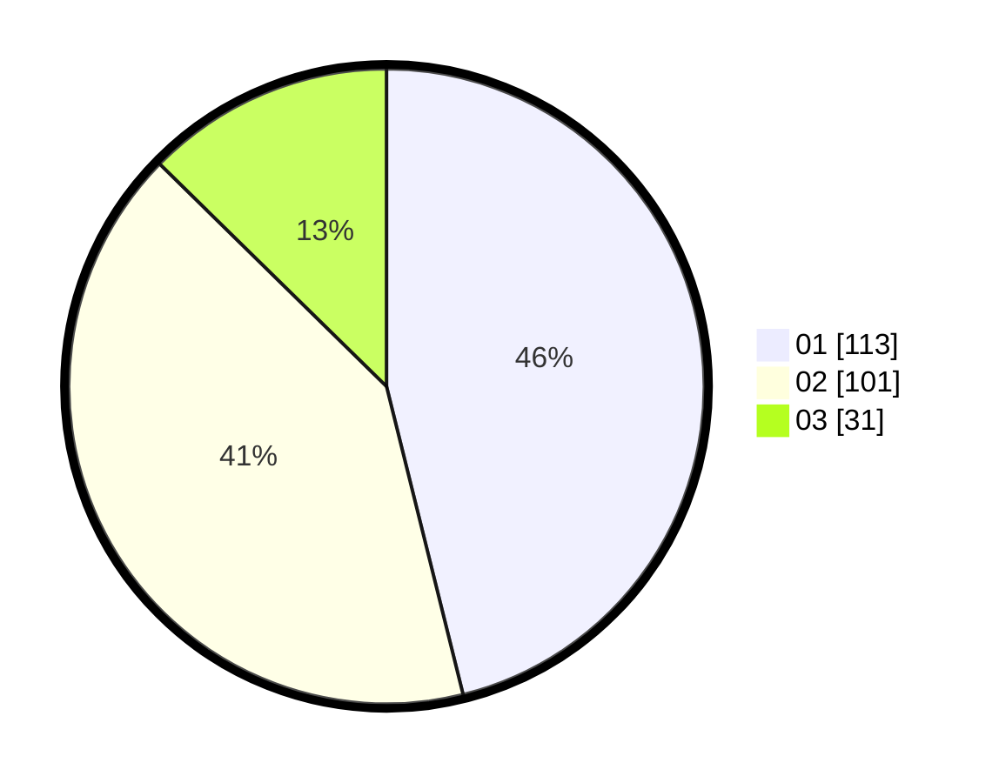

# Hasil

Hasil perolehan suara paslon dapat dilihat pada file paslon-01.txt, paslon-02.txt, dan paslon-03.txt.

Jika tidak ada, artinya data tersebut belum ada pada SIREKAP.

## Perolehan Suara

 * Paslon 01: **113**.
 * Paslon 02: **101**.
 * Paslon 03: **31**.

## Foto C Plano

https://sirekap-obj-formc.kpu.go.id/dc59/pemilu/ppwp/31/74/10/10/05/3174101005035-20240214-193821--f2f2764b-70eb-4059-8233-60e526eb4f59.jpg

https://sirekap-obj-formc.kpu.go.id/dc59/pemilu/ppwp/31/74/10/10/05/3174101005035-20240214-193834--aadfe95b-139d-4874-bf1d-3796875b31aa.jpg

https://sirekap-obj-formc.kpu.go.id/dc59/pemilu/ppwp/31/74/10/10/05/3174101005035-20240214-193849--cec86cbe-8b64-43a4-af29-00643b8b6599.jpg

## DATA PEMILIH TETAP

Jumlah pemilih dalam DPT: **297**.
 * L: **146**.
 * P: **151**.

## DATA PENGGUNA HAK PILIH

Jumlah pengguna hak pilih dalam DPT: **244**.
 * L: **121**.
 * P: **123**.

Jumlah pengguna hak pilih dalam DPTb: **0**.
 * L: **0**.
 * P: **0**.

Jumlah pengguna hak pilih dalam DPK: **5**.
 * L: **1**.
 * P: **4**.

Jumlah pengguna hak pilih: **249**.
 * L: **122**.
 * P: **127**.

## JUMLAH SUARA SAH DAN TIDAK SAH

JUMLAH SELURUH SUARA SAH: **245**.

JUMLAH SUARA TIDAK SAH: **4**.

JUMLAH SELURUH SUARA SAH DAN SUARA TIDAK SAH: **249**.
