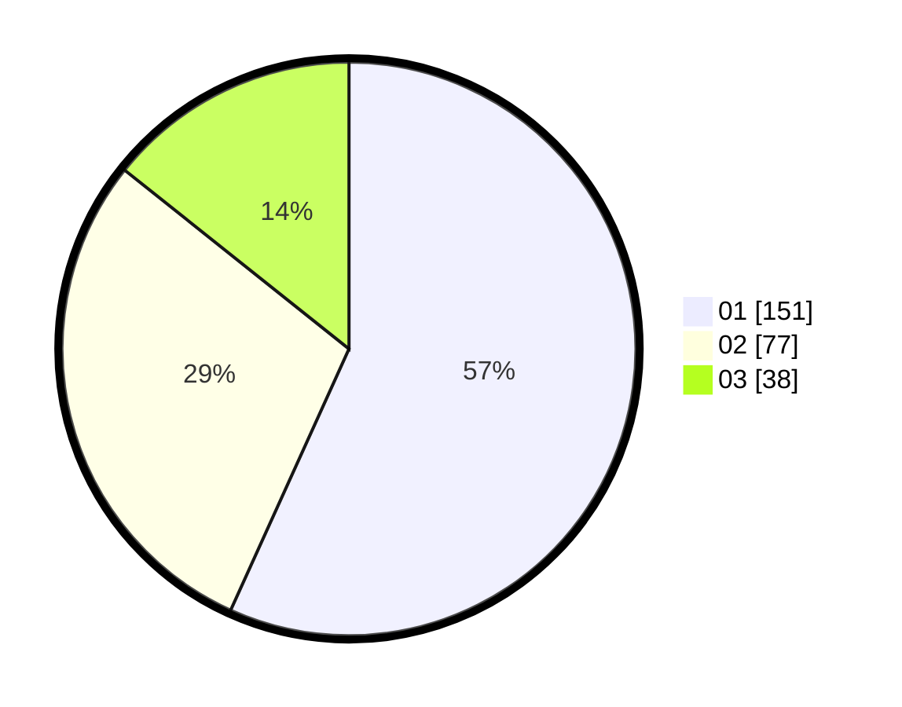

# Hasil

Hasil perolehan suara paslon dapat dilihat pada file paslon-01.txt, paslon-02.txt, dan paslon-03.txt.

Jika tidak ada, artinya data tersebut belum ada pada SIREKAP.

## Perolehan Suara

 * Paslon 01: **151**.
 * Paslon 02: **77**.
 * Paslon 03: **38**.

## Foto C Plano

https://sirekap-obj-formc.kpu.go.id/aea9/pemilu/ppwp/31/74/10/10/05/3174101005036-20240216-211230--0e70fb02-3519-4ed9-bd7c-606927670026.jpg

https://sirekap-obj-formc.kpu.go.id/aea9/pemilu/ppwp/31/74/10/10/05/3174101005036-20240216-211231--b2f766e8-10d8-4491-ad5c-01afc070732f.jpg

https://sirekap-obj-formc.kpu.go.id/aea9/pemilu/ppwp/31/74/10/10/05/3174101005036-20240216-210623--3b54a16a-b088-452c-9460-543441802d04.jpg

## DATA PEMILIH TETAP

Jumlah pemilih dalam DPT: **292**.
 * L: **139**.
 * P: **153**.

## DATA PENGGUNA HAK PILIH

Jumlah pengguna hak pilih dalam DPT: **242**.
 * L: **109**.
 * P: **133**.

Jumlah pengguna hak pilih dalam DPTb: **14**.
 * L: **3**.
 * P: **11**.

Jumlah pengguna hak pilih dalam DPK: **2**.
 * L: **0**.
 * P: **2**.

Jumlah pengguna hak pilih: **258**.
 * L: **112**.
 * P: **146**.

## JUMLAH SUARA SAH DAN TIDAK SAH

JUMLAH SELURUH SUARA SAH: **266**.

JUMLAH SUARA TIDAK SAH: **2**.

JUMLAH SELURUH SUARA SAH DAN SUARA TIDAK SAH: **268**.
