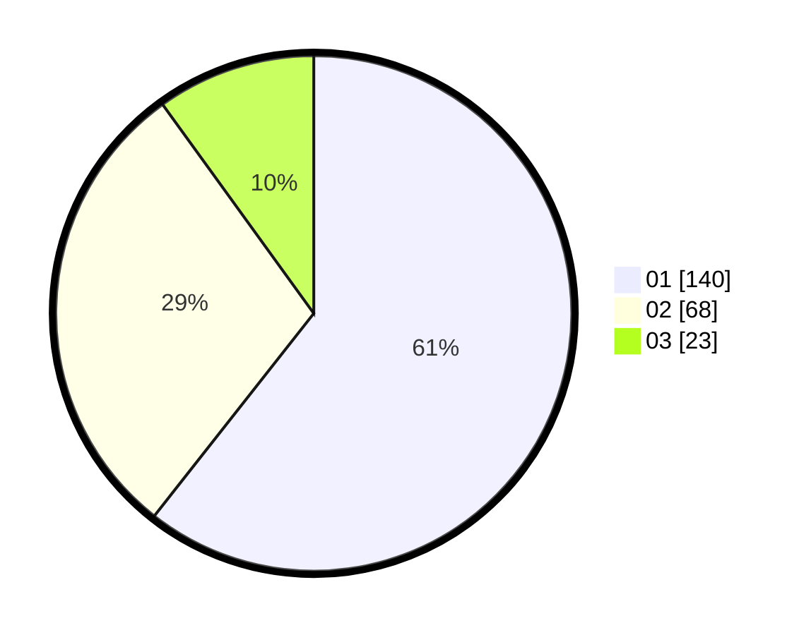

# Hasil

Hasil perolehan suara paslon dapat dilihat pada file paslon-01.txt, paslon-02.txt, dan paslon-03.txt.

Jika tidak ada, artinya data tersebut belum ada pada SIREKAP.

## Perolehan Suara

 * Paslon 01: **140**.
 * Paslon 02: **68**.
 * Paslon 03: **23**.

## Foto C Plano

https://sirekap-obj-formc.kpu.go.id/c53f/pemilu/ppwp/31/74/10/10/05/3174101005039-20240214-202439--1574f9b9-723e-46a1-a3a3-4104ddf0cd67.jpg

https://sirekap-obj-formc.kpu.go.id/c53f/pemilu/ppwp/31/74/10/10/05/3174101005039-20240214-195609--d375507e-14ee-4f52-b75c-9b5573f21312.jpg

https://sirekap-obj-formc.kpu.go.id/c53f/pemilu/ppwp/31/74/10/10/05/3174101005039-20240214-195615--15f60fb7-7498-4cc2-82e0-5eb4da439c42.jpg

## DATA PEMILIH TETAP

Jumlah pemilih dalam DPT: **275**.
 * L: **142**.
 * P: **133**.

## DATA PENGGUNA HAK PILIH

Jumlah pengguna hak pilih dalam DPT: **231**.
 * L: **116**.
 * P: **115**.

Jumlah pengguna hak pilih dalam DPTb: **1**.
 * L: **1**.
 * P: **0**.

Jumlah pengguna hak pilih dalam DPK: **1**.
 * L: **0**.
 * P: **1**.

Jumlah pengguna hak pilih: **233**.
 * L: **117**.
 * P: **116**.

## JUMLAH SUARA SAH DAN TIDAK SAH

JUMLAH SELURUH SUARA SAH: **231**.

JUMLAH SUARA TIDAK SAH: **2**.

JUMLAH SELURUH SUARA SAH DAN SUARA TIDAK SAH: **233**.
