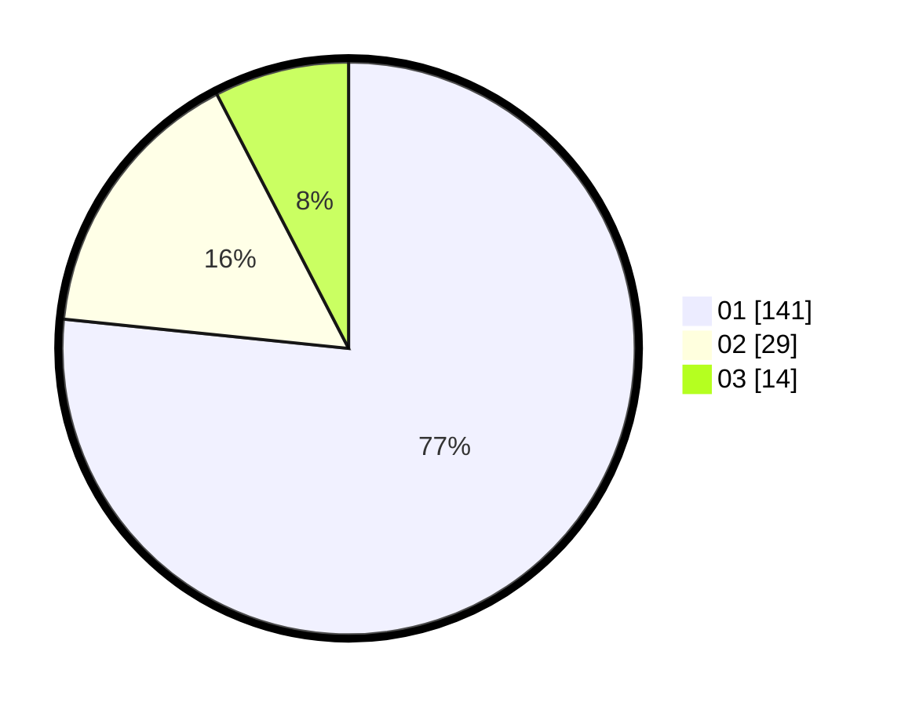

# Hasil

Hasil perolehan suara paslon dapat dilihat pada file paslon-01.txt, paslon-02.txt, dan paslon-03.txt.

Jika tidak ada, artinya data tersebut belum ada pada SIREKAP.

## Perolehan Suara

 * Paslon 01: **141**.
 * Paslon 02: **29**.
 * Paslon 03: **14**.

## Foto C Plano

https://sirekap-obj-formc.kpu.go.id/7dc0/pemilu/ppwp/31/74/10/10/05/3174101005041-20240216-230607--3f495706-65f2-4fea-8018-e6c5bd247fbe.jpg

https://sirekap-obj-formc.kpu.go.id/7dc0/pemilu/ppwp/31/74/10/10/05/3174101005041-20240216-230608--39b67182-6df9-4486-8bd3-f348fe74ab98.jpg

https://sirekap-obj-formc.kpu.go.id/7dc0/pemilu/ppwp/31/74/10/10/05/3174101005041-20240216-230607--1ed5359c-6941-499e-aabf-5da1a27f9e39.jpg

## DATA PEMILIH TETAP

Jumlah pemilih dalam DPT: **241**.
 * L: **115**.
 * P: **126**.

## DATA PENGGUNA HAK PILIH

Jumlah pengguna hak pilih dalam DPT: **184**.
 * L: **88**.
 * P: **96**.

Jumlah pengguna hak pilih dalam DPTb: **1**.
 * L: **0**.
 * P: **1**.

Jumlah pengguna hak pilih dalam DPK: **0**.
 * L: **0**.
 * P: **0**.

Jumlah pengguna hak pilih: **185**.
 * L: **88**.
 * P: **97**.

## JUMLAH SUARA SAH DAN TIDAK SAH

JUMLAH SELURUH SUARA SAH: **184**.

JUMLAH SUARA TIDAK SAH: **1**.

JUMLAH SELURUH SUARA SAH DAN SUARA TIDAK SAH: **185**.
