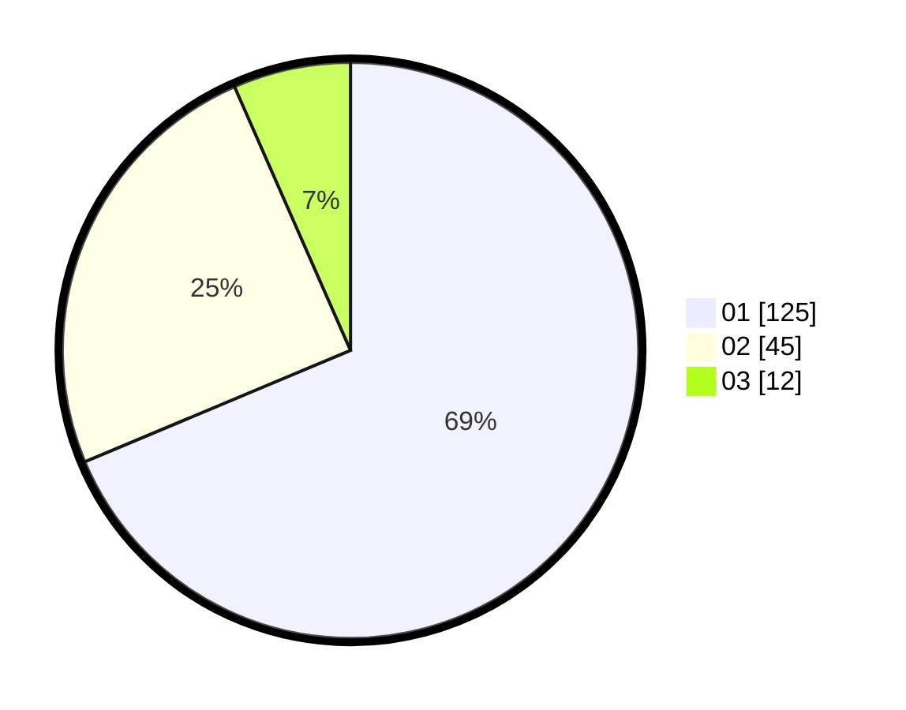

# Hasil

Hasil perolehan suara paslon dapat dilihat pada file paslon-01.txt, paslon-02.txt, dan paslon-03.txt.

Jika tidak ada, artinya data tersebut belum ada pada SIREKAP.

## Perolehan Suara

 * Paslon 01: **125**.
 * Paslon 02: **45**.
 * Paslon 03: **12**.

## Foto C Plano

https://sirekap-obj-formc.kpu.go.id/0381/pemilu/ppwp/31/74/10/10/05/3174101005042-20240216-193406--47425dab-58f9-411f-a92c-b6fef4bbda8d.jpg

https://sirekap-obj-formc.kpu.go.id/0381/pemilu/ppwp/31/74/10/10/05/3174101005042-20240216-193407--71d3d306-3f86-4089-a090-e0a6475ac8e1.jpg

https://sirekap-obj-formc.kpu.go.id/0381/pemilu/ppwp/31/74/10/10/05/3174101005042-20240216-193406--5b7a972b-f54d-4d8d-b86a-395c624b736b.jpg

## DATA PEMILIH TETAP

Jumlah pemilih dalam DPT: **238**.
 * L: **118**.
 * P: **120**.

## DATA PENGGUNA HAK PILIH

Jumlah pengguna hak pilih dalam DPT: **181**.
 * L: **84**.
 * P: **97**.

Jumlah pengguna hak pilih dalam DPTb: **0**.
 * L: **0**.
 * P: **0**.

Jumlah pengguna hak pilih dalam DPK: **2**.
 * L: **1**.
 * P: **1**.

Jumlah pengguna hak pilih: **183**.
 * L: **85**.
 * P: **98**.

## JUMLAH SUARA SAH DAN TIDAK SAH

JUMLAH SELURUH SUARA SAH: **182**.

JUMLAH SUARA TIDAK SAH: **1**.

JUMLAH SELURUH SUARA SAH DAN SUARA TIDAK SAH: **183**.
