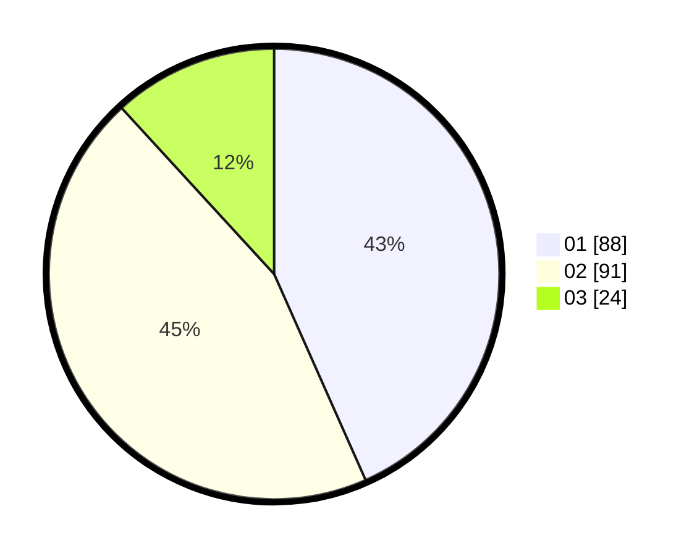

# Hasil

Hasil perolehan suara paslon dapat dilihat pada file paslon-01.txt, paslon-02.txt, dan paslon-03.txt.

Jika tidak ada, artinya data tersebut belum ada pada SIREKAP.

## Perolehan Suara

 * Paslon 01: **88**.
 * Paslon 02: **91**.
 * Paslon 03: **24**.

## Foto C Plano

https://sirekap-obj-formc.kpu.go.id/494d/pemilu/ppwp/31/74/10/10/05/3174101005051-20240215-202728--34501185-3c00-4246-afe0-163801d17dd0.jpg

https://sirekap-obj-formc.kpu.go.id/494d/pemilu/ppwp/31/74/10/10/05/3174101005051-20240216-010350--29c9bc5b-b537-4f7e-b444-d33b1371b72d.jpg

https://sirekap-obj-formc.kpu.go.id/494d/pemilu/ppwp/31/74/10/10/05/3174101005051-20240215-202733--e56a6d1d-5692-4405-ba6a-ac6f977389a2.jpg

## DATA PEMILIH TETAP

Jumlah pemilih dalam DPT: **280**.
 * L: **145**.
 * P: **135**.

## DATA PENGGUNA HAK PILIH

Jumlah pengguna hak pilih dalam DPT: **277**.
 * L: **142**.
 * P: **135**.

Jumlah pengguna hak pilih dalam DPTb: **0**.
 * L: **0**.
 * P: **0**.

Jumlah pengguna hak pilih dalam DPK: **0**.
 * L: **0**.
 * P: **0**.

Jumlah pengguna hak pilih: **278**.
 * L: **142**.
 * P: **136**.

## JUMLAH SUARA SAH DAN TIDAK SAH

JUMLAH SELURUH SUARA SAH: **203**.

JUMLAH SUARA TIDAK SAH: **4**.

JUMLAH SELURUH SUARA SAH DAN SUARA TIDAK SAH: **207**.
