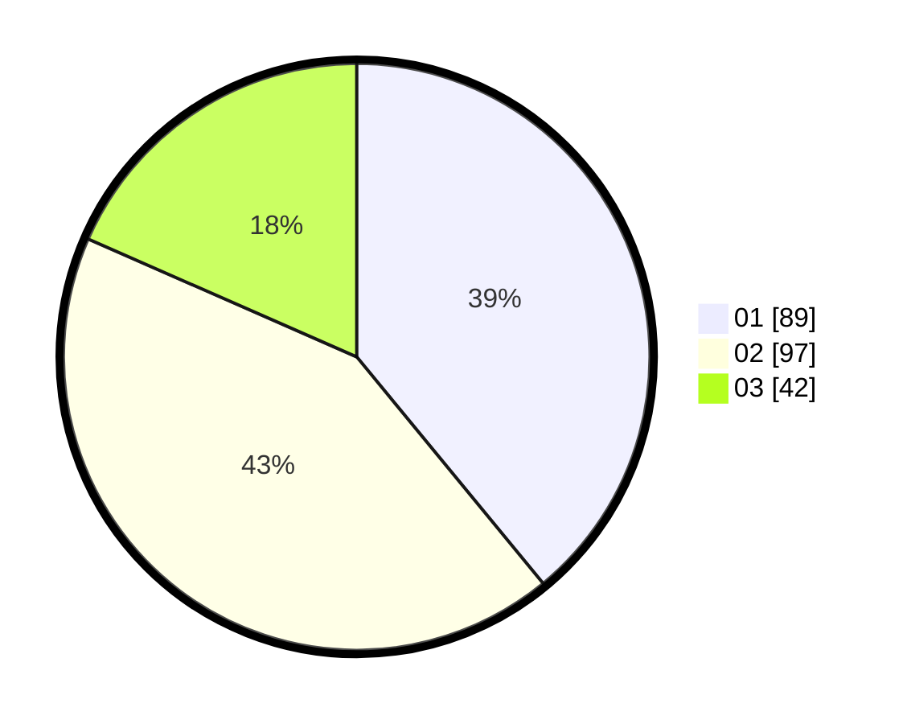

# Hasil

Hasil perolehan suara paslon dapat dilihat pada file paslon-01.txt, paslon-02.txt, dan paslon-03.txt.

Jika tidak ada, artinya data tersebut belum ada pada SIREKAP.

## Perolehan Suara

 * Paslon 01: **89**.
 * Paslon 02: **97**.
 * Paslon 03: **42**.

## Foto C Plano

https://sirekap-obj-formc.kpu.go.id/0b87/pemilu/ppwp/31/74/10/10/05/3174101005074-20240214-210215--6bd390cd-c503-436e-9c4e-d18f928dfc87.jpg

https://sirekap-obj-formc.kpu.go.id/0b87/pemilu/ppwp/31/74/10/10/05/3174101005074-20240214-203353--335dbe77-c808-415a-8792-41be3e325736.jpg

https://sirekap-obj-formc.kpu.go.id/0b87/pemilu/ppwp/31/74/10/10/05/3174101005074-20240214-203430--a695742b-7e2c-45de-80d5-904b0a98edab.jpg

## DATA PEMILIH TETAP

Jumlah pemilih dalam DPT: **281**.
 * L: **145**.
 * P: **136**.

## DATA PENGGUNA HAK PILIH

Jumlah pengguna hak pilih dalam DPT: **228**.
 * L: **114**.
 * P: **114**.

Jumlah pengguna hak pilih dalam DPTb: **0**.
 * L: **0**.
 * P: **0**.

Jumlah pengguna hak pilih dalam DPK: **2**.
 * L: **2**.
 * P: **0**.

Jumlah pengguna hak pilih: **230**.
 * L: **116**.
 * P: **114**.

## JUMLAH SUARA SAH DAN TIDAK SAH

JUMLAH SELURUH SUARA SAH: **228**.

JUMLAH SUARA TIDAK SAH: **2**.

JUMLAH SELURUH SUARA SAH DAN SUARA TIDAK SAH: **230**.
