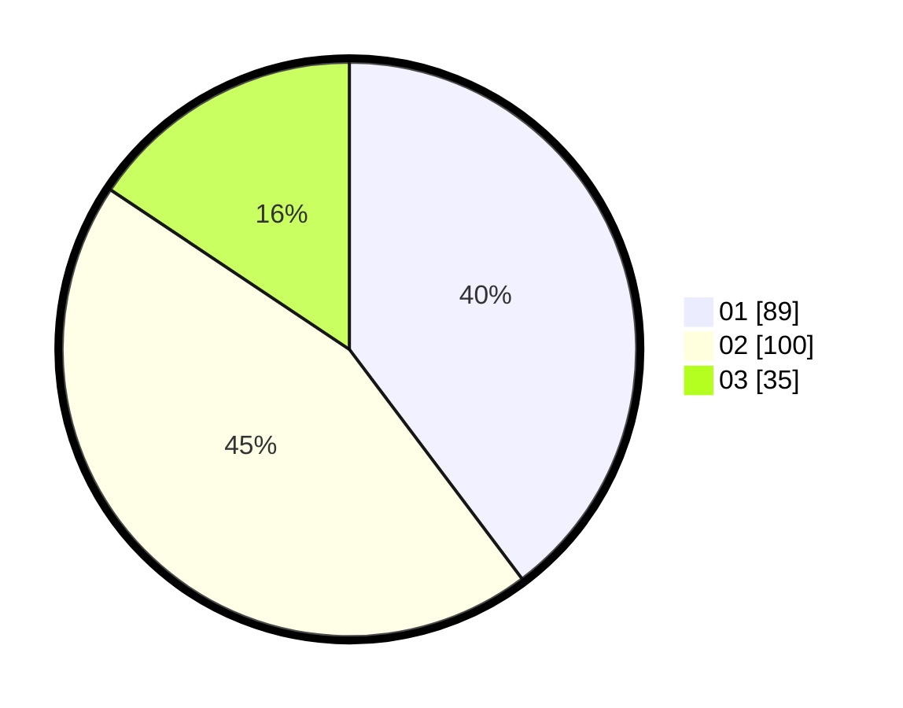

# Hasil

Hasil perolehan suara paslon dapat dilihat pada file paslon-01.txt, paslon-02.txt, dan paslon-03.txt.

Jika tidak ada, artinya data tersebut belum ada pada SIREKAP.

## Perolehan Suara

 * Paslon 01: **89**.
 * Paslon 02: **100**.
 * Paslon 03: **35**.

## Foto C Plano

https://sirekap-obj-formc.kpu.go.id/e49d/pemilu/ppwp/31/74/10/10/05/3174101005075-20240216-195437--cb071c16-3dd6-4d95-8cdf-902510358aa9.jpg

https://sirekap-obj-formc.kpu.go.id/e49d/pemilu/ppwp/31/74/10/10/05/3174101005075-20240214-202025--22aa5455-040d-40e4-a1db-3dcf7db5c854.jpg

https://sirekap-obj-formc.kpu.go.id/e49d/pemilu/ppwp/31/74/10/10/05/3174101005075-20240214-230111--61d536fd-7608-4d0f-8197-1c3fdc28c401.jpg

## DATA PEMILIH TETAP

Jumlah pemilih dalam DPT: **278**.
 * L: **143**.
 * P: **135**.

## DATA PENGGUNA HAK PILIH

Jumlah pengguna hak pilih dalam DPT: **219**.
 * L: **107**.
 * P: **112**.

Jumlah pengguna hak pilih dalam DPTb: **2**.
 * L: **1**.
 * P: **1**.

Jumlah pengguna hak pilih dalam DPK: **7**.
 * L: **2**.
 * P: **5**.

Jumlah pengguna hak pilih: **228**.
 * L: **110**.
 * P: **118**.

## JUMLAH SUARA SAH DAN TIDAK SAH

JUMLAH SELURUH SUARA SAH: **224**.

JUMLAH SUARA TIDAK SAH: **4**.

JUMLAH SELURUH SUARA SAH DAN SUARA TIDAK SAH: **228**.
