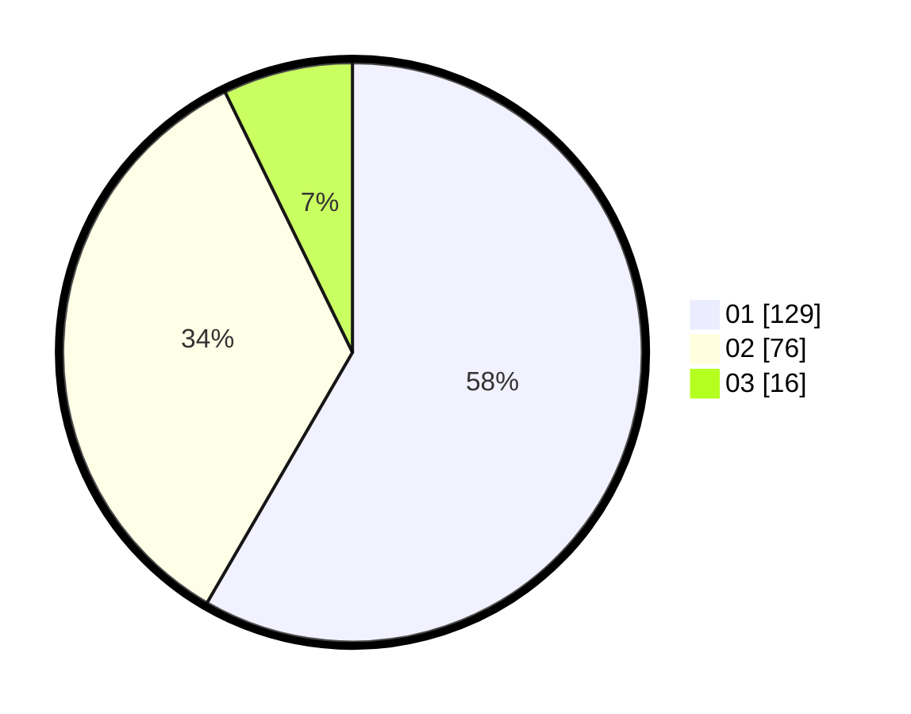

# Hasil

Hasil perolehan suara paslon dapat dilihat pada file paslon-01.txt, paslon-02.txt, dan paslon-03.txt.

Jika tidak ada, artinya data tersebut belum ada pada SIREKAP.

## Perolehan Suara

 * Paslon 01: **129**.
 * Paslon 02: **76**.
 * Paslon 03: **16**.

## Foto C Plano

https://sirekap-obj-formc.kpu.go.id/75b0/pemilu/ppwp/31/74/10/10/05/3174101005076-20240214-200539--be28c171-38e9-4b55-9c73-fd65457ee46a.jpg

https://sirekap-obj-formc.kpu.go.id/75b0/pemilu/ppwp/31/74/10/10/05/3174101005076-20240214-193712--0e8ff2a8-7226-4a51-af01-7110ccf8a2fc.jpg

https://sirekap-obj-formc.kpu.go.id/75b0/pemilu/ppwp/31/74/10/10/05/3174101005076-20240214-193819--34b0b486-a4cd-4531-bace-1d5da945bf18.jpg

## DATA PEMILIH TETAP

Jumlah pemilih dalam DPT: **282**.
 * L: **127**.
 * P: **155**.

## DATA PENGGUNA HAK PILIH

Jumlah pengguna hak pilih dalam DPT: **212**.
 * L: **87**.
 * P: **125**.

Jumlah pengguna hak pilih dalam DPTb: **9**.
 * L: **5**.
 * P: **4**.

Jumlah pengguna hak pilih dalam DPK: **2**.
 * L: **1**.
 * P: **1**.

Jumlah pengguna hak pilih: **223**.
 * L: **93**.
 * P: **130**.

## JUMLAH SUARA SAH DAN TIDAK SAH

JUMLAH SELURUH SUARA SAH: **221**.

JUMLAH SUARA TIDAK SAH: **2**.

JUMLAH SELURUH SUARA SAH DAN SUARA TIDAK SAH: **223**.
