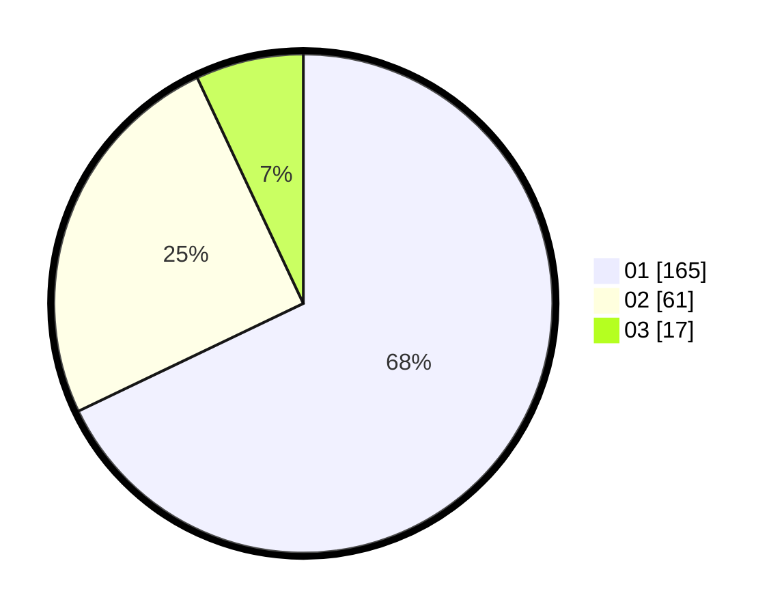

# Hasil

Hasil perolehan suara paslon dapat dilihat pada file paslon-01.txt, paslon-02.txt, dan paslon-03.txt.

Jika tidak ada, artinya data tersebut belum ada pada SIREKAP.

## Perolehan Suara

 * Paslon 01: **165**.
 * Paslon 02: **61**.
 * Paslon 03: **17**.

## Foto C Plano

https://sirekap-obj-formc.kpu.go.id/33c7/pemilu/ppwp/31/74/10/10/05/3174101005077-20240216-144208--3ceb6e2c-871f-4be7-8a51-6359be3a004d.jpg

https://sirekap-obj-formc.kpu.go.id/33c7/pemilu/ppwp/31/74/10/10/05/3174101005077-20240216-144209--7520ce39-9913-4a58-8aff-836c59186f46.jpg

https://sirekap-obj-formc.kpu.go.id/33c7/pemilu/ppwp/31/74/10/10/05/3174101005077-20240216-144208--75bc1306-337e-4b3b-abfe-e18bb5bb74d6.jpg

## DATA PEMILIH TETAP

Jumlah pemilih dalam DPT: **288**.
 * L: **157**.
 * P: **131**.

## DATA PENGGUNA HAK PILIH

Jumlah pengguna hak pilih dalam DPT: **217**.
 * L: **112**.
 * P: **105**.

Jumlah pengguna hak pilih dalam DPTb: **26**.
 * L: **5**.
 * P: **21**.

Jumlah pengguna hak pilih dalam DPK: **1**.
 * L: **1**.
 * P: **0**.

Jumlah pengguna hak pilih: **244**.
 * L: **118**.
 * P: **126**.

## JUMLAH SUARA SAH DAN TIDAK SAH

JUMLAH SELURUH SUARA SAH: **243**.

JUMLAH SUARA TIDAK SAH: **1**.

JUMLAH SELURUH SUARA SAH DAN SUARA TIDAK SAH: **244**.
