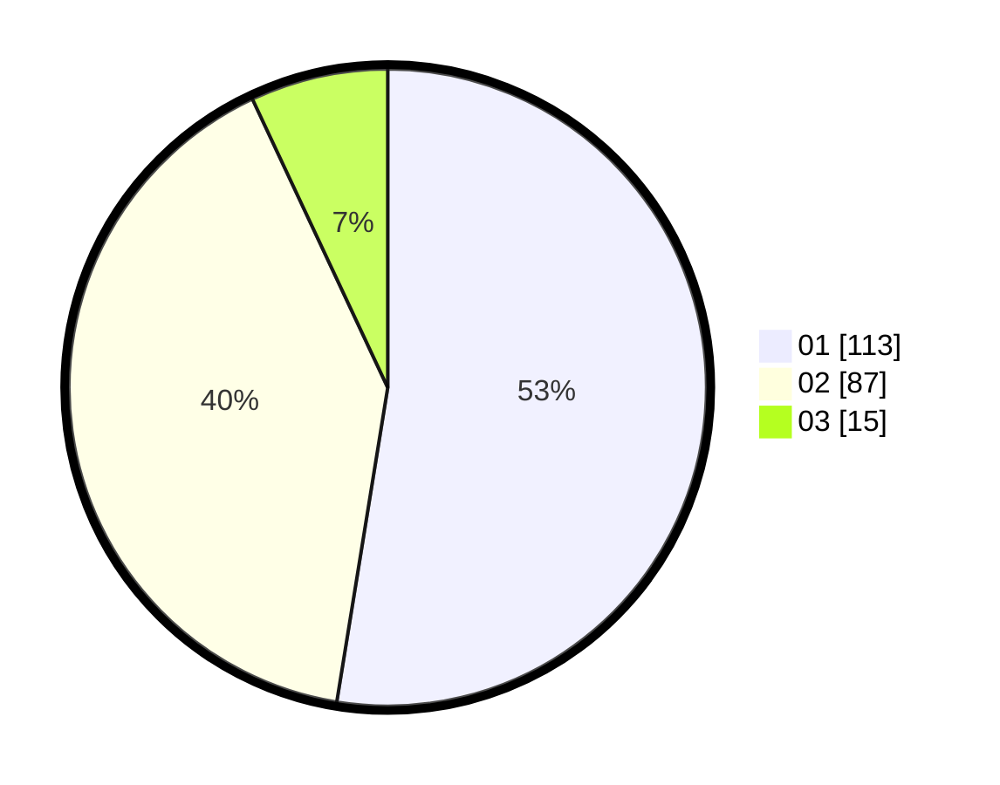

# Hasil

Hasil perolehan suara paslon dapat dilihat pada file paslon-01.txt, paslon-02.txt, dan paslon-03.txt.

Jika tidak ada, artinya data tersebut belum ada pada SIREKAP.

## Perolehan Suara

 * Paslon 01: **113**.
 * Paslon 02: **87**.
 * Paslon 03: **15**.

## Foto C Plano

https://sirekap-obj-formc.kpu.go.id/da99/pemilu/ppwp/31/74/10/10/05/3174101005085-20240214-155044--e1d185bb-2cf2-4c37-9fd2-c746266ed4be.jpg

https://sirekap-obj-formc.kpu.go.id/da99/pemilu/ppwp/31/74/10/10/05/3174101005085-20240214-155320--5b8186a7-0670-498f-a984-4f7146f8c354.jpg

https://sirekap-obj-formc.kpu.go.id/da99/pemilu/ppwp/31/74/10/10/05/3174101005085-20240214-155508--eab1e7c8-55eb-4567-9a86-936d3820f97f.jpg

## DATA PEMILIH TETAP

Jumlah pemilih dalam DPT: **270**.
 * L: **135**.
 * P: **135**.

## DATA PENGGUNA HAK PILIH

Jumlah pengguna hak pilih dalam DPT: **219**.
 * L: **108**.
 * P: **111**.

Jumlah pengguna hak pilih dalam DPTb: **4**.
 * L: **2**.
 * P: **2**.

Jumlah pengguna hak pilih dalam DPK: **2**.
 * L: **0**.
 * P: **2**.

Jumlah pengguna hak pilih: **225**.
 * L: **110**.
 * P: **115**.

## JUMLAH SUARA SAH DAN TIDAK SAH

JUMLAH SELURUH SUARA SAH: **215**.

JUMLAH SUARA TIDAK SAH: **10**.

JUMLAH SELURUH SUARA SAH DAN SUARA TIDAK SAH: **225**.
