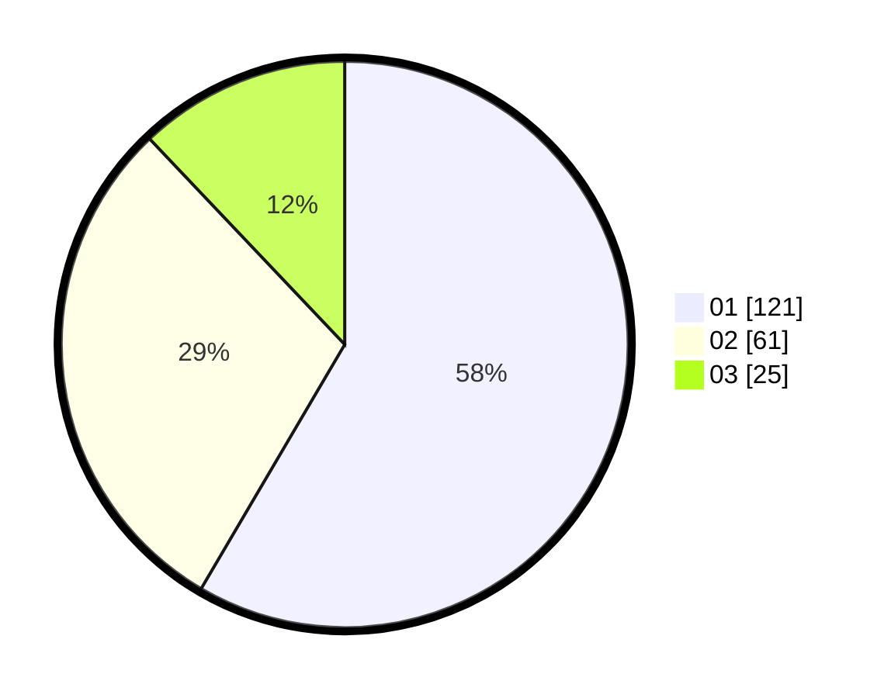

# Hasil

Hasil perolehan suara paslon dapat dilihat pada file paslon-01.txt, paslon-02.txt, dan paslon-03.txt.

Jika tidak ada, artinya data tersebut belum ada pada SIREKAP.

## Perolehan Suara

 * Paslon 01: **121**.
 * Paslon 02: **61**.
 * Paslon 03: **25**.

## Foto C Plano

https://sirekap-obj-formc.kpu.go.id/84ac/pemilu/ppwp/31/74/10/10/05/3174101005088-20240215-205736--94347958-4e70-42b7-9b20-27553e216fe2.jpg

https://sirekap-obj-formc.kpu.go.id/84ac/pemilu/ppwp/31/74/10/10/05/3174101005088-20240215-205738--df6daf0f-cc4b-442b-a487-906d51c757b9.jpg

https://sirekap-obj-formc.kpu.go.id/84ac/pemilu/ppwp/31/74/10/10/05/3174101005088-20240215-205737--5ab56232-6401-487b-ba8d-b932f4d883c7.jpg

## DATA PEMILIH TETAP

Jumlah pemilih dalam DPT: **257**.
 * L: **129**.
 * P: **128**.

## DATA PENGGUNA HAK PILIH

Jumlah pengguna hak pilih dalam DPT: **207**.
 * L: **104**.
 * P: **103**.

Jumlah pengguna hak pilih dalam DPTb: **0**.
 * L: **0**.
 * P: **0**.

Jumlah pengguna hak pilih dalam DPK: **0**.
 * L: **0**.
 * P: **0**.

Jumlah pengguna hak pilih: **207**.
 * L: **104**.
 * P: **103**.

## JUMLAH SUARA SAH DAN TIDAK SAH

JUMLAH SELURUH SUARA SAH: **207**.

JUMLAH SUARA TIDAK SAH: **0**.

JUMLAH SELURUH SUARA SAH DAN SUARA TIDAK SAH: **207**.
