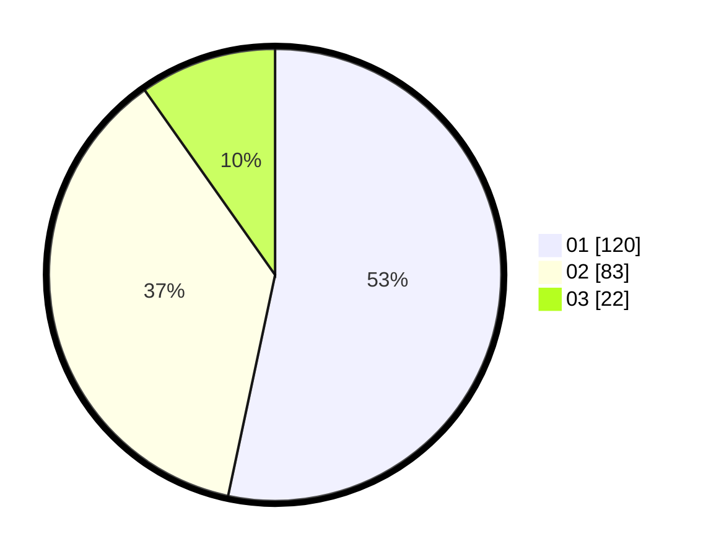

# Hasil

Hasil perolehan suara paslon dapat dilihat pada file paslon-01.txt, paslon-02.txt, dan paslon-03.txt.

Jika tidak ada, artinya data tersebut belum ada pada SIREKAP.

## Perolehan Suara

 * Paslon 01: **120**.
 * Paslon 02: **83**.
 * Paslon 03: **22**.

## Foto C Plano

https://sirekap-obj-formc.kpu.go.id/f9f8/pemilu/ppwp/31/74/10/10/05/3174101005093-20240214-194825--bc03c074-ad56-4d89-800f-61c7a9aabbcb.jpg

https://sirekap-obj-formc.kpu.go.id/f9f8/pemilu/ppwp/31/74/10/10/05/3174101005093-20240214-194834--7854c6d0-a2ac-45ea-b531-5861ad411466.jpg

https://sirekap-obj-formc.kpu.go.id/f9f8/pemilu/ppwp/31/74/10/10/05/3174101005093-20240214-200905--250e5e16-cf57-425f-bd8f-f5c674e9abaf.jpg

## DATA PEMILIH TETAP

Jumlah pemilih dalam DPT: **265**.
 * L: **120**.
 * P: **145**.

## DATA PENGGUNA HAK PILIH

Jumlah pengguna hak pilih dalam DPT: **224**.
 * L: **98**.
 * P: **126**.

Jumlah pengguna hak pilih dalam DPTb: **3**.
 * L: **2**.
 * P: **1**.

Jumlah pengguna hak pilih dalam DPK: **0**.
 * L: **0**.
 * P: **0**.

Jumlah pengguna hak pilih: **227**.
 * L: **100**.
 * P: **127**.

## JUMLAH SUARA SAH DAN TIDAK SAH

JUMLAH SELURUH SUARA SAH: **225**.

JUMLAH SUARA TIDAK SAH: **2**.

JUMLAH SELURUH SUARA SAH DAN SUARA TIDAK SAH: **227**.
