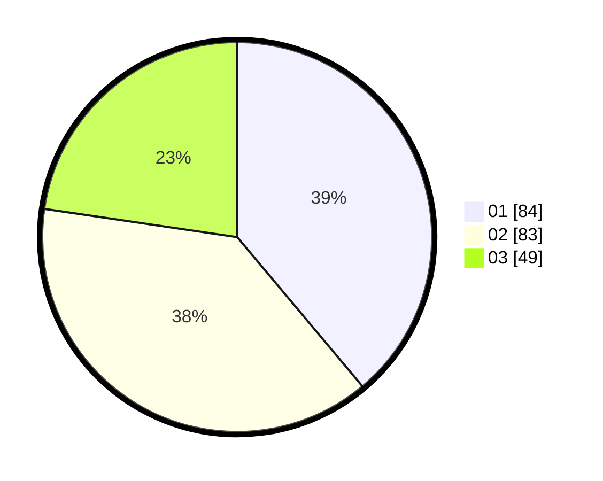

# Hasil

Hasil perolehan suara paslon dapat dilihat pada file paslon-01.txt, paslon-02.txt, dan paslon-03.txt.

Jika tidak ada, artinya data tersebut belum ada pada SIREKAP.

## Perolehan Suara

 * Paslon 01: **84**.
 * Paslon 02: **83**.
 * Paslon 03: **49**.

## Foto C Plano

https://sirekap-obj-formc.kpu.go.id/76d4/pemilu/ppwp/31/74/10/10/05/3174101005098-20240216-071316--3268f3d4-0e93-46b0-ab63-ffc815b859f5.jpg

https://sirekap-obj-formc.kpu.go.id/76d4/pemilu/ppwp/31/74/10/10/05/3174101005098-20240214-155748--4e457175-cbe3-458d-82e1-c9728245c6c6.jpg

https://sirekap-obj-formc.kpu.go.id/76d4/pemilu/ppwp/31/74/10/10/05/3174101005098-20240216-071317--86b67336-1939-4eb1-92eb-9ff9ddb36490.jpg

## DATA PEMILIH TETAP

Jumlah pemilih dalam DPT: **257**.
 * L: **122**.
 * P: **135**.

## DATA PENGGUNA HAK PILIH

Jumlah pengguna hak pilih dalam DPT: **217**.
 * L: **101**.
 * P: **116**.

Jumlah pengguna hak pilih dalam DPTb: **1**.
 * L: **0**.
 * P: **1**.

Jumlah pengguna hak pilih dalam DPK: **0**.
 * L: **0**.
 * P: **0**.

Jumlah pengguna hak pilih: **218**.
 * L: **101**.
 * P: **117**.

## JUMLAH SUARA SAH DAN TIDAK SAH

JUMLAH SELURUH SUARA SAH: **216**.

JUMLAH SUARA TIDAK SAH: **2**.

JUMLAH SELURUH SUARA SAH DAN SUARA TIDAK SAH: **218**.
