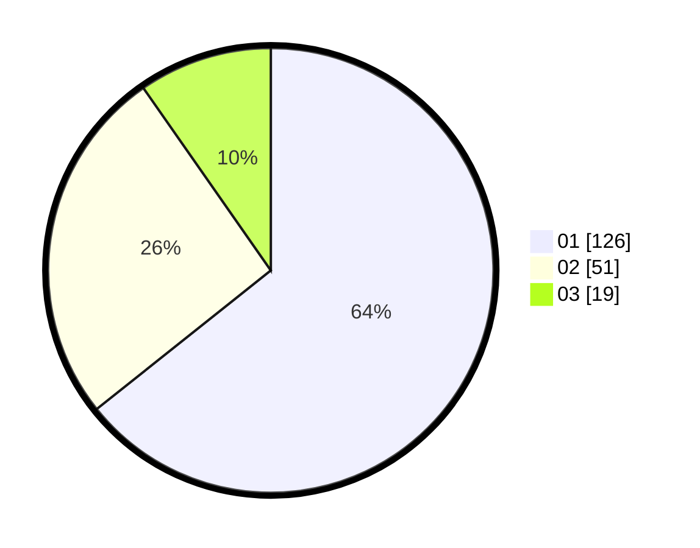

# Hasil

Hasil perolehan suara paslon dapat dilihat pada file paslon-01.txt, paslon-02.txt, dan paslon-03.txt.

Jika tidak ada, artinya data tersebut belum ada pada SIREKAP.

## Perolehan Suara

 * Paslon 01: **126**.
 * Paslon 02: **51**.
 * Paslon 03: **19**.

## Foto C Plano

https://sirekap-obj-formc.kpu.go.id/6a3d/pemilu/ppwp/31/74/10/10/05/3174101005109-20240217-103509--5bdd629e-48f0-40f0-81ac-585e894da4be.jpg

https://sirekap-obj-formc.kpu.go.id/6a3d/pemilu/ppwp/31/74/10/10/05/3174101005109-20240217-103352--9450b166-7c14-4d14-8b9e-c17e26544655.jpg

https://sirekap-obj-formc.kpu.go.id/6a3d/pemilu/ppwp/31/74/10/10/05/3174101005109-20240217-103418--8ebf8172-3235-4531-a012-d27b49e8ec2b.jpg

## DATA PEMILIH TETAP

Jumlah pemilih dalam DPT: **261**.
 * L: **132**.
 * P: **129**.

## DATA PENGGUNA HAK PILIH

Jumlah pengguna hak pilih dalam DPT: **199**.
 * L: **97**.
 * P: **102**.

Jumlah pengguna hak pilih dalam DPTb: **0**.
 * L: **0**.
 * P: **0**.

Jumlah pengguna hak pilih dalam DPK: **3**.
 * L: **2**.
 * P: **1**.

Jumlah pengguna hak pilih: **202**.
 * L: **99**.
 * P: **103**.

## JUMLAH SUARA SAH DAN TIDAK SAH

JUMLAH SELURUH SUARA SAH: **196**.

JUMLAH SUARA TIDAK SAH: **6**.

JUMLAH SELURUH SUARA SAH DAN SUARA TIDAK SAH: **202**.
