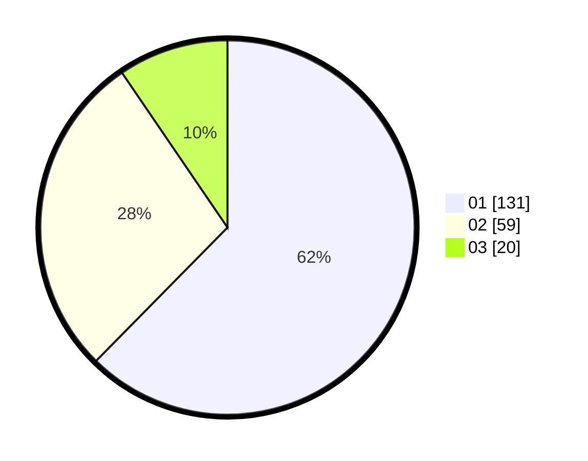

# Hasil

Hasil perolehan suara paslon dapat dilihat pada file paslon-01.txt, paslon-02.txt, dan paslon-03.txt.

Jika tidak ada, artinya data tersebut belum ada pada SIREKAP.

## Perolehan Suara

 * Paslon 01: **131**.
 * Paslon 02: **59**.
 * Paslon 03: **20**.

## Foto C Plano

https://sirekap-obj-formc.kpu.go.id/7d3c/pemilu/ppwp/31/74/10/10/05/3174101005114-20240218-130629--5555b814-6b9e-42ef-8116-681da08b1f4a.jpg

https://sirekap-obj-formc.kpu.go.id/7d3c/pemilu/ppwp/31/74/10/10/05/3174101005114-20240218-130631--f34385db-c69b-4757-8afe-64346f1cfcf9.jpg

https://sirekap-obj-formc.kpu.go.id/7d3c/pemilu/ppwp/31/74/10/10/05/3174101005114-20240218-130630--e4bfaa74-e62b-4c24-8448-d33b4989f706.jpg

## DATA PEMILIH TETAP

Jumlah pemilih dalam DPT: **269**.
 * L: **135**.
 * P: **134**.

## DATA PENGGUNA HAK PILIH

Jumlah pengguna hak pilih dalam DPT: **210**.
 * L: **101**.
 * P: **109**.

Jumlah pengguna hak pilih dalam DPTb: **0**.
 * L: **0**.
 * P: **0**.

Jumlah pengguna hak pilih dalam DPK: **0**.
 * L: **0**.
 * P: **0**.

Jumlah pengguna hak pilih: **210**.
 * L: **101**.
 * P: **109**.

## JUMLAH SUARA SAH DAN TIDAK SAH

JUMLAH SELURUH SUARA SAH: **210**.

JUMLAH SUARA TIDAK SAH: **0**.

JUMLAH SELURUH SUARA SAH DAN SUARA TIDAK SAH: **210**.
