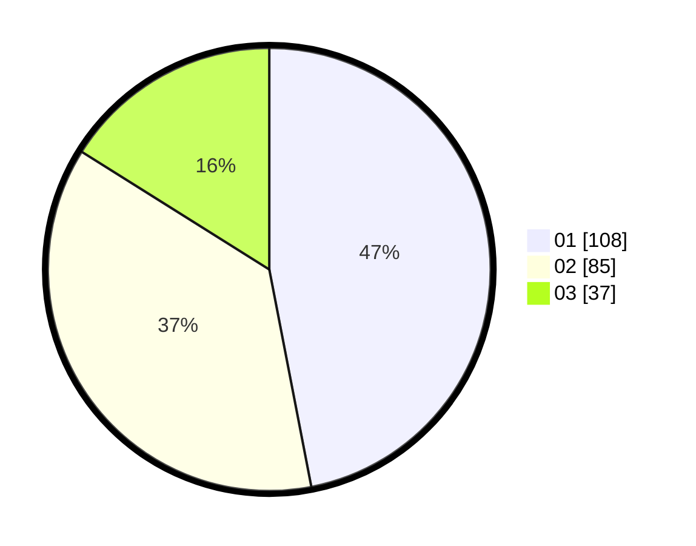

# Hasil

Hasil perolehan suara paslon dapat dilihat pada file paslon-01.txt, paslon-02.txt, dan paslon-03.txt.

Jika tidak ada, artinya data tersebut belum ada pada SIREKAP.

## Perolehan Suara

 * Paslon 01: **108**.
 * Paslon 02: **85**.
 * Paslon 03: **37**.

## Foto C Plano

https://sirekap-obj-formc.kpu.go.id/0331/pemilu/ppwp/31/74/10/10/05/3174101005126-20240214-155247--069d4702-d97c-4726-8f5d-1895bc921e1b.jpg

https://sirekap-obj-formc.kpu.go.id/0331/pemilu/ppwp/31/74/10/10/05/3174101005126-20240214-155704--356da709-4f25-44cf-a40e-bcdb382748fe.jpg

https://sirekap-obj-formc.kpu.go.id/0331/pemilu/ppwp/31/74/10/10/05/3174101005126-20240214-192450--cf49d95b-df66-4a37-aa5b-d5faf62d450f.jpg

## DATA PEMILIH TETAP

Jumlah pemilih dalam DPT: **292**.
 * L: **142**.
 * P: **150**.

## DATA PENGGUNA HAK PILIH

Jumlah pengguna hak pilih dalam DPT: **217**.
 * L: **103**.
 * P: **114**.

Jumlah pengguna hak pilih dalam DPTb: **14**.
 * L: **7**.
 * P: **7**.

Jumlah pengguna hak pilih dalam DPK: **1**.
 * L: **0**.
 * P: **1**.

Jumlah pengguna hak pilih: **232**.
 * L: **110**.
 * P: **122**.

## JUMLAH SUARA SAH DAN TIDAK SAH

JUMLAH SELURUH SUARA SAH: **230**.

JUMLAH SUARA TIDAK SAH: **2**.

JUMLAH SELURUH SUARA SAH DAN SUARA TIDAK SAH: **232**.
