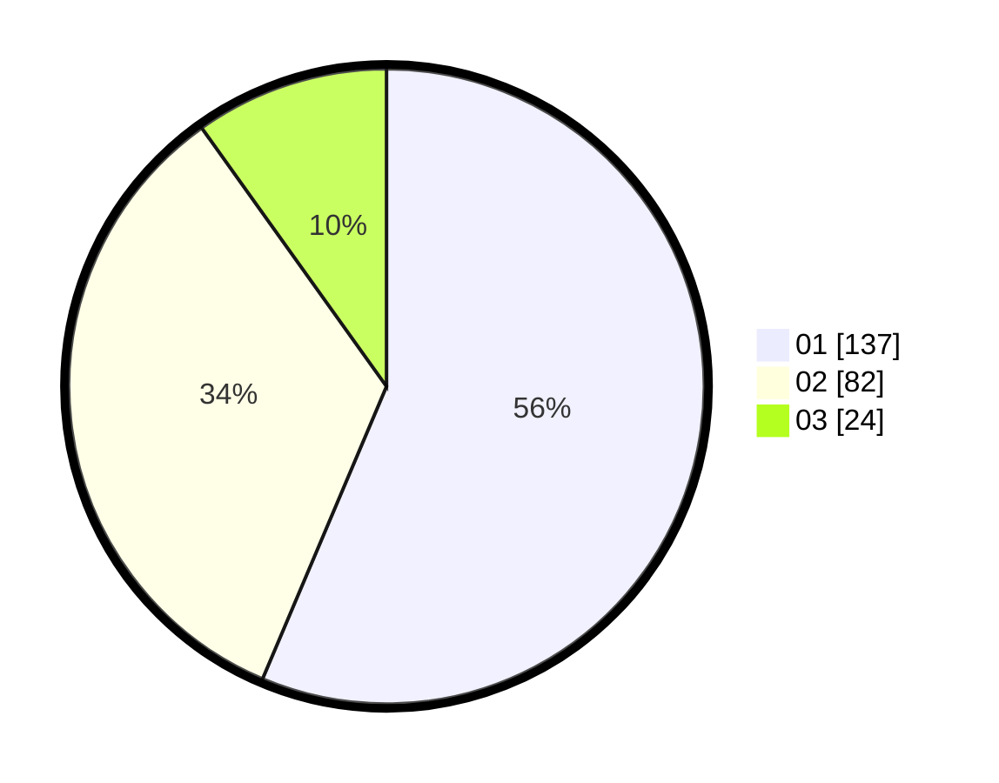

# Hasil

Hasil perolehan suara paslon dapat dilihat pada file paslon-01.txt, paslon-02.txt, dan paslon-03.txt.

Jika tidak ada, artinya data tersebut belum ada pada SIREKAP.

## Perolehan Suara

 * Paslon 01: **137**.
 * Paslon 02: **82**.
 * Paslon 03: **24**.

## Foto C Plano

https://sirekap-obj-formc.kpu.go.id/2cb0/pemilu/ppwp/31/74/10/10/05/3174101005139-20240218-072346--419bcee8-095a-464c-a020-31b6a0420664.jpg

https://sirekap-obj-formc.kpu.go.id/2cb0/pemilu/ppwp/31/74/10/10/05/3174101005139-20240218-073945--a3744bbf-b434-454e-a0fa-451e75b34f4a.jpg

https://sirekap-obj-formc.kpu.go.id/2cb0/pemilu/ppwp/31/74/10/10/05/3174101005139-20240218-080219--5bbd262f-5f47-4d7f-aae3-392882257619.jpg

## DATA PEMILIH TETAP

Jumlah pemilih dalam DPT: **283**.
 * L: **146**.
 * P: **137**.

## DATA PENGGUNA HAK PILIH

Jumlah pengguna hak pilih dalam DPT: **244**.
 * L: **121**.
 * P: **123**.

Jumlah pengguna hak pilih dalam DPTb: **0**.
 * L: **0**.
 * P: **0**.

Jumlah pengguna hak pilih dalam DPK: **3**.
 * L: **1**.
 * P: **2**.

Jumlah pengguna hak pilih: **247**.
 * L: **122**.
 * P: **125**.

## JUMLAH SUARA SAH DAN TIDAK SAH

JUMLAH SELURUH SUARA SAH: **243**.

JUMLAH SUARA TIDAK SAH: **4**.

JUMLAH SELURUH SUARA SAH DAN SUARA TIDAK SAH: **247**.
