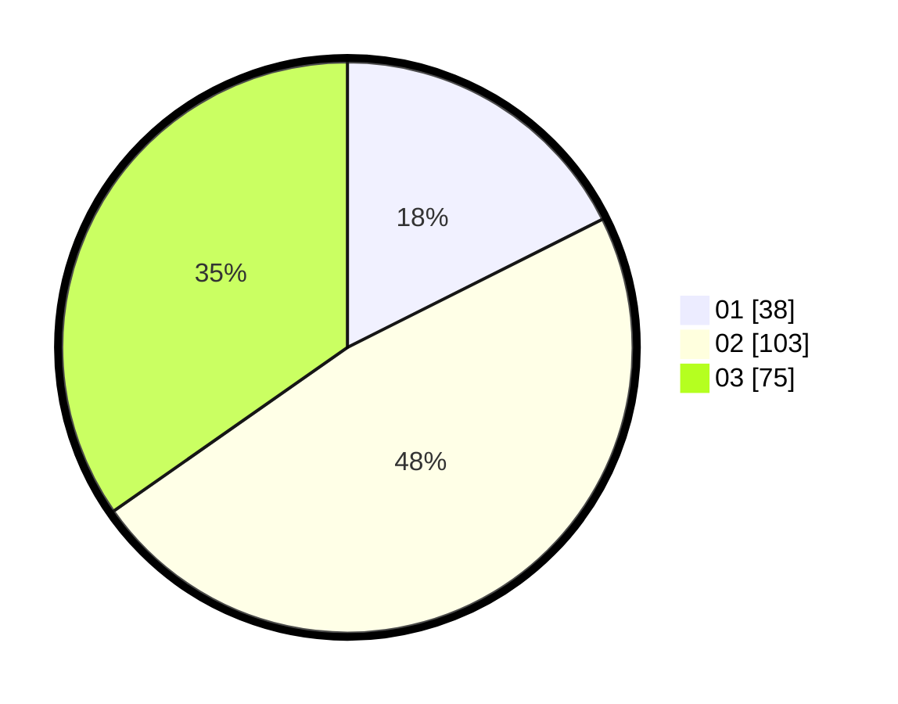

# Hasil

Hasil perolehan suara paslon dapat dilihat pada file paslon-01.txt, paslon-02.txt, dan paslon-03.txt.

Jika tidak ada, artinya data tersebut belum ada pada SIREKAP.

## Perolehan Suara

 * Paslon 01: **38**.
 * Paslon 02: **103**.
 * Paslon 03: **75**.

## Foto C Plano

https://sirekap-obj-formc.kpu.go.id/d5d4/pemilu/ppwp/31/74/10/10/05/3174101005140-20240214-155421--cc6222ea-a1f9-4d7e-8169-7aca2cd3f120.jpg

https://sirekap-obj-formc.kpu.go.id/d5d4/pemilu/ppwp/31/74/10/10/05/3174101005140-20240214-155628--e74f359a-cd67-4c6e-9649-e27eefdfd4bc.jpg

https://sirekap-obj-formc.kpu.go.id/d5d4/pemilu/ppwp/31/74/10/10/05/3174101005140-20240214-155707--2c219a48-0cf4-474c-b2af-ef51713e2fed.jpg

## DATA PEMILIH TETAP

Jumlah pemilih dalam DPT: **255**.
 * L: **118**.
 * P: **137**.

## DATA PENGGUNA HAK PILIH

Jumlah pengguna hak pilih dalam DPT: **191**.
 * L: **87**.
 * P: **104**.

Jumlah pengguna hak pilih dalam DPTb: **27**.
 * L: **12**.
 * P: **15**.

Jumlah pengguna hak pilih dalam DPK: **4**.
 * L: **2**.
 * P: **2**.

Jumlah pengguna hak pilih: **222**.
 * L: **101**.
 * P: **121**.

## JUMLAH SUARA SAH DAN TIDAK SAH

JUMLAH SELURUH SUARA SAH: **216**.

JUMLAH SUARA TIDAK SAH: **6**.

JUMLAH SELURUH SUARA SAH DAN SUARA TIDAK SAH: **222**.
