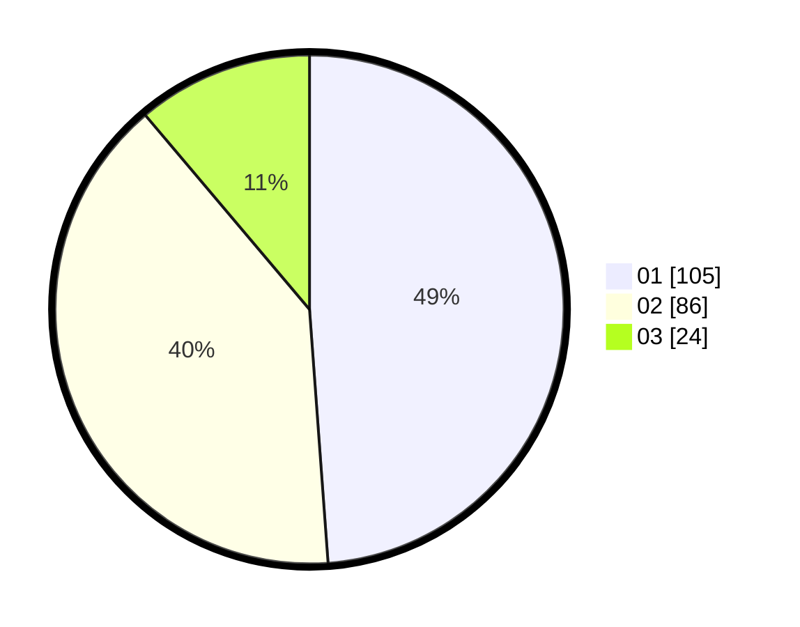

# Hasil

Hasil perolehan suara paslon dapat dilihat pada file paslon-01.txt, paslon-02.txt, dan paslon-03.txt.

Jika tidak ada, artinya data tersebut belum ada pada SIREKAP.

## Perolehan Suara

 * Paslon 01: **105**.
 * Paslon 02: **86**.
 * Paslon 03: **24**.

## Foto C Plano

https://sirekap-obj-formc.kpu.go.id/063b/pemilu/ppwp/31/75/01/10/01/3175011001002-20240214-224707--41f14869-d788-4b42-8cd0-decb6846a8cb.jpg

https://sirekap-obj-formc.kpu.go.id/063b/pemilu/ppwp/31/75/01/10/01/3175011001002-20240214-235454--b70cc256-61be-482e-9f9f-6b4fb5af7fe9.jpg

https://sirekap-obj-formc.kpu.go.id/063b/pemilu/ppwp/31/75/01/10/01/3175011001002-20240214-235643--6d297686-3540-45ea-b844-5cafaadab8ee.jpg
