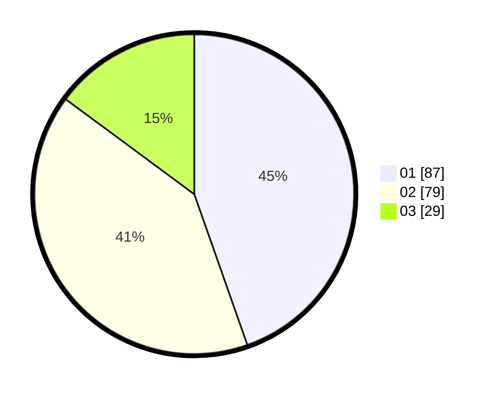

# Hasil

Hasil perolehan suara paslon dapat dilihat pada file paslon-01.txt, paslon-02.txt, dan paslon-03.txt.

Jika tidak ada, artinya data tersebut belum ada pada SIREKAP.

## Perolehan Suara

 * Paslon 01: **87**.
 * Paslon 02: **79**.
 * Paslon 03: **29**.

## Foto C Plano

https://sirekap-obj-formc.kpu.go.id/2566/pemilu/ppwp/31/75/01/10/01/3175011001005-20240215-053436--d3f261f1-da9c-4da7-95d5-457f995cd1b2.jpg

https://sirekap-obj-formc.kpu.go.id/2566/pemilu/ppwp/31/75/01/10/01/3175011001005-20240215-053617--6b063192-262a-4ca4-8de6-07629d8511db.jpg

https://sirekap-obj-formc.kpu.go.id/2566/pemilu/ppwp/31/75/01/10/01/3175011001005-20240215-053719--f1aea39e-791e-4eee-94b5-cc595dbf8b4f.jpg
