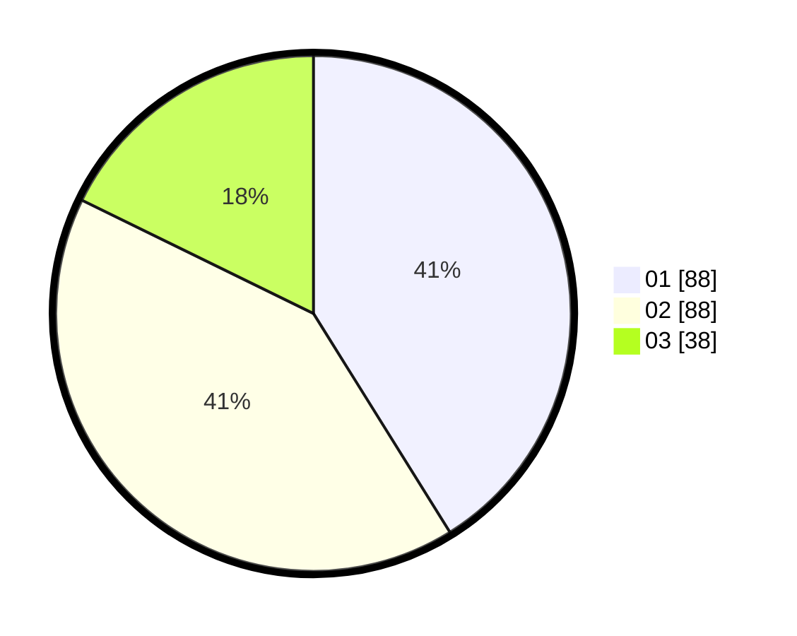

# Hasil

Hasil perolehan suara paslon dapat dilihat pada file paslon-01.txt, paslon-02.txt, dan paslon-03.txt.

Jika tidak ada, artinya data tersebut belum ada pada SIREKAP.

## Perolehan Suara

 * Paslon 01: **88**.
 * Paslon 02: **88**.
 * Paslon 03: **38**.

## Foto C Plano

https://sirekap-obj-formc.kpu.go.id/17df/pemilu/ppwp/31/75/01/10/01/3175011001011-20240215-024436--be06a4f9-93fa-4cae-a4aa-4bb5fed6ea50.jpg

https://sirekap-obj-formc.kpu.go.id/17df/pemilu/ppwp/31/75/01/10/01/3175011001011-20240215-000918--52a45fa2-9765-4721-bc23-fc7f699c8ef1.jpg

https://sirekap-obj-formc.kpu.go.id/17df/pemilu/ppwp/31/75/01/10/01/3175011001011-20240215-000954--4fc0bac4-67a5-4863-8ae4-dca6c365cb19.jpg
