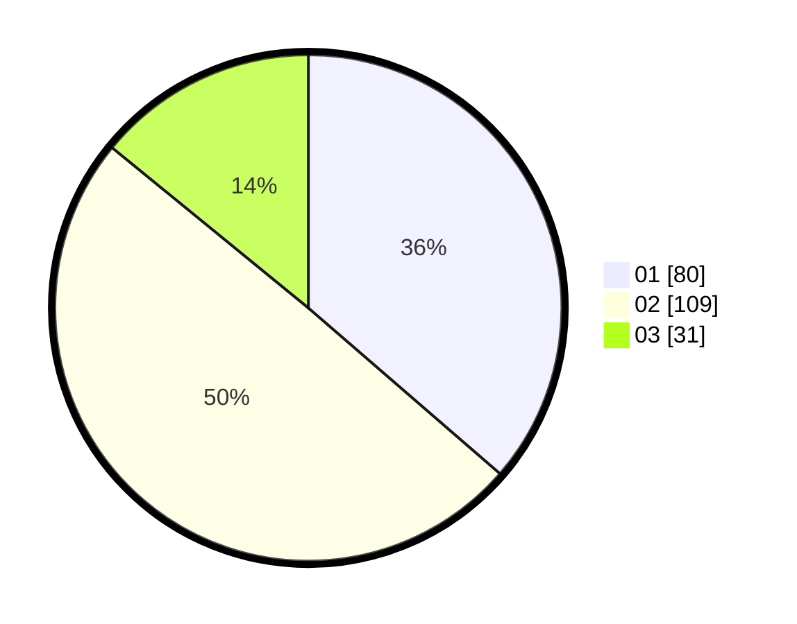

# Hasil

Hasil perolehan suara paslon dapat dilihat pada file paslon-01.txt, paslon-02.txt, dan paslon-03.txt.

Jika tidak ada, artinya data tersebut belum ada pada SIREKAP.

## Perolehan Suara

 * Paslon 01: **80**.
 * Paslon 02: **109**.
 * Paslon 03: **31**.

## Foto C Plano

https://sirekap-obj-formc.kpu.go.id/168d/pemilu/ppwp/31/75/01/10/01/3175011001013-20240214-200846--e6b19987-0e03-49d7-aeaf-554c52c30afb.jpg

https://sirekap-obj-formc.kpu.go.id/168d/pemilu/ppwp/31/75/01/10/01/3175011001013-20240214-214717--becab3b4-4e7d-4b3c-849d-e0d6e3cf727a.jpg

https://sirekap-obj-formc.kpu.go.id/168d/pemilu/ppwp/31/75/01/10/01/3175011001013-20240214-214544--70a86aa3-fa0b-46e6-9861-1c5fb1464b96.jpg
