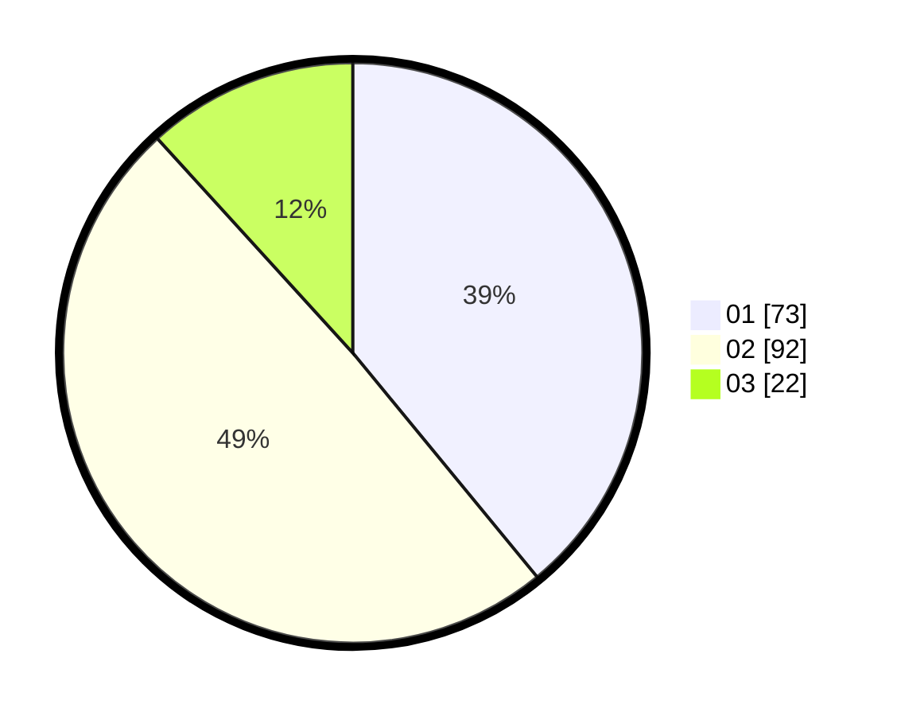

# Hasil

Hasil perolehan suara paslon dapat dilihat pada file paslon-01.txt, paslon-02.txt, dan paslon-03.txt.

Jika tidak ada, artinya data tersebut belum ada pada SIREKAP.

## Perolehan Suara

 * Paslon 01: **73**.
 * Paslon 02: **92**.
 * Paslon 03: **22**.

## Foto C Plano

https://sirekap-obj-formc.kpu.go.id/d685/pemilu/ppwp/31/75/01/10/01/3175011001014-20240216-145007--b8a33818-3182-41cc-8b29-c95a3564febf.jpg

https://sirekap-obj-formc.kpu.go.id/d685/pemilu/ppwp/31/75/01/10/01/3175011001014-20240216-145039--13eb3ede-5952-48f5-8401-98829b7cc696.jpg

https://sirekap-obj-formc.kpu.go.id/d685/pemilu/ppwp/31/75/01/10/01/3175011001014-20240216-145032--59a19c62-941a-4552-bc55-dd1c809bf75d.jpg
