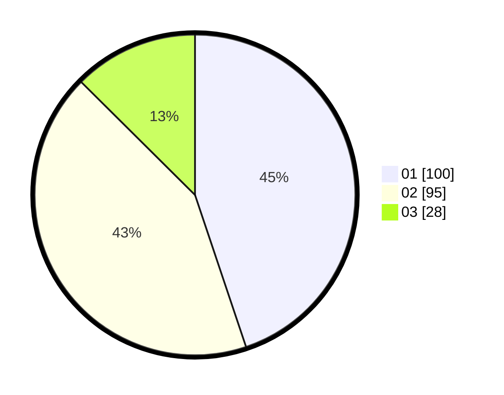

# Hasil

Hasil perolehan suara paslon dapat dilihat pada file paslon-01.txt, paslon-02.txt, dan paslon-03.txt.

Jika tidak ada, artinya data tersebut belum ada pada SIREKAP.

## Perolehan Suara

 * Paslon 01: **100**.
 * Paslon 02: **95**.
 * Paslon 03: **28**.

## Foto C Plano

https://sirekap-obj-formc.kpu.go.id/ee23/pemilu/ppwp/31/75/01/10/01/3175011001018-20240217-065558--71feb76e-f622-4d90-b2e3-08e0a92d9dc3.jpg

https://sirekap-obj-formc.kpu.go.id/ee23/pemilu/ppwp/31/75/01/10/01/3175011001018-20240217-082126--e2ea08ba-dffc-46d0-8e84-9d295f7b5436.jpg

https://sirekap-obj-formc.kpu.go.id/ee23/pemilu/ppwp/31/75/01/10/01/3175011001018-20240217-083119--4fa890de-30aa-4e56-b9d4-208639623993.jpg
