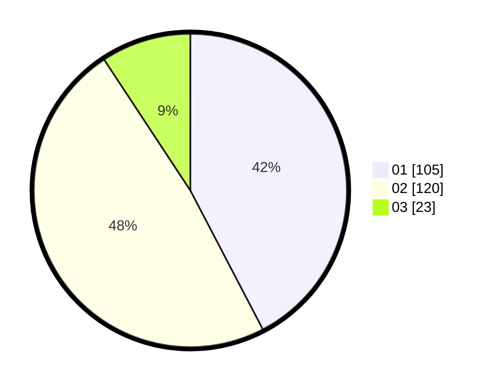

# Hasil

Hasil perolehan suara paslon dapat dilihat pada file paslon-01.txt, paslon-02.txt, dan paslon-03.txt.

Jika tidak ada, artinya data tersebut belum ada pada SIREKAP.

## Perolehan Suara

 * Paslon 01: **105**.
 * Paslon 02: **120**.
 * Paslon 03: **23**.

## Foto C Plano

https://sirekap-obj-formc.kpu.go.id/7c93/pemilu/ppwp/31/75/01/10/01/3175011001020-20240214-195424--52dc7bd9-11bd-45d0-af37-8c00ac3704d0.jpg

https://sirekap-obj-formc.kpu.go.id/7c93/pemilu/ppwp/31/75/01/10/01/3175011001020-20240214-195434--d16d28dd-020e-47f1-b29d-60da28dcd09f.jpg

https://sirekap-obj-formc.kpu.go.id/7c93/pemilu/ppwp/31/75/01/10/01/3175011001020-20240214-195442--c57896f3-5130-4521-87b7-7dad410884a1.jpg
