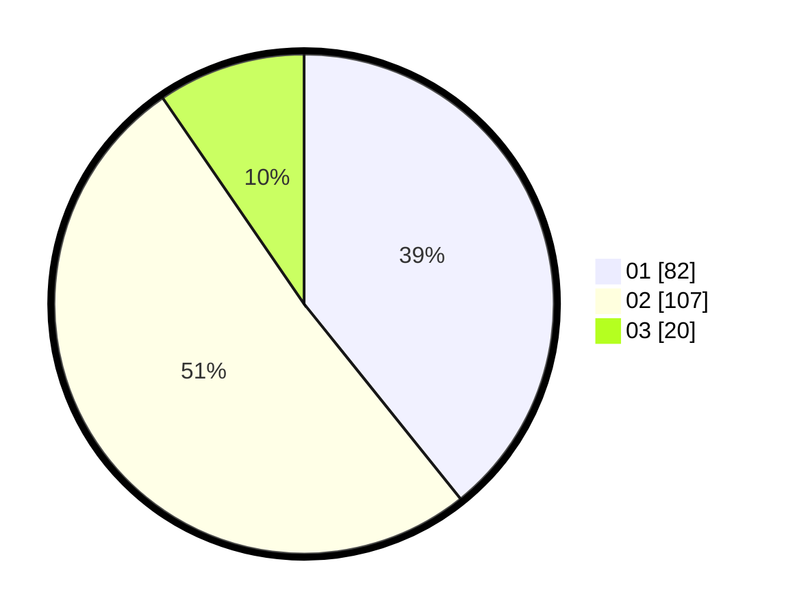

# Hasil

Hasil perolehan suara paslon dapat dilihat pada file paslon-01.txt, paslon-02.txt, dan paslon-03.txt.

Jika tidak ada, artinya data tersebut belum ada pada SIREKAP.

## Perolehan Suara

 * Paslon 01: **82**.
 * Paslon 02: **107**.
 * Paslon 03: **20**.

## Foto C Plano

https://sirekap-obj-formc.kpu.go.id/1323/pemilu/ppwp/31/75/01/10/01/3175011001024-20240215-214442--42e43cf5-25c9-4a40-a84a-a68a6a45b13e.jpg

https://sirekap-obj-formc.kpu.go.id/1323/pemilu/ppwp/31/75/01/10/01/3175011001024-20240215-214444--b6035b71-88e4-42f5-98a2-da46ce3247bd.jpg

https://sirekap-obj-formc.kpu.go.id/1323/pemilu/ppwp/31/75/01/10/01/3175011001024-20240215-214443--8d8ff113-1b6a-48be-aed9-d397c752512a.jpg

## DATA PEMILIH TETAP

Jumlah pemilih dalam DPT: **260**.
 * L: **117**.
 * P: **143**.

## DATA PENGGUNA HAK PILIH

Jumlah pengguna hak pilih dalam DPT: **201**.
 * L: **87**.
 * P: **114**.

Jumlah pengguna hak pilih dalam DPTb: **6**.
 * L: **1**.
 * P: **5**.

Jumlah pengguna hak pilih dalam DPK: **4**.
 * L: **1**.
 * P: **3**.

Jumlah pengguna hak pilih: **211**.
 * L: **89**.
 * P: **123**.

## JUMLAH SUARA SAH DAN TIDAK SAH

JUMLAH SELURUH SUARA SAH: **209**.

JUMLAH SUARA TIDAK SAH: **2**.

JUMLAH SELURUH SUARA SAH DAN SUARA TIDAK SAH: **211**.
