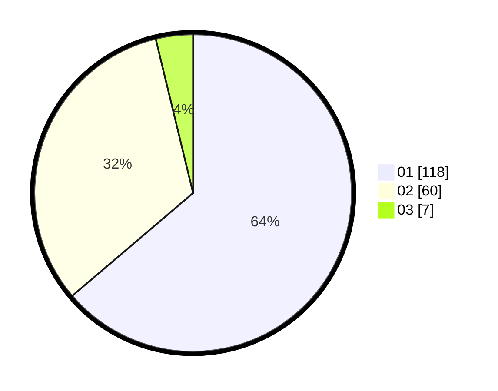

# Hasil

Hasil perolehan suara paslon dapat dilihat pada file paslon-01.txt, paslon-02.txt, dan paslon-03.txt.

Jika tidak ada, artinya data tersebut belum ada pada SIREKAP.

## Perolehan Suara

 * Paslon 01: **118**.
 * Paslon 02: **60**.
 * Paslon 03: **7**.

## Foto C Plano

https://sirekap-obj-formc.kpu.go.id/d0e8/pemilu/ppwp/31/75/01/10/01/3175011001028-20240214-212738--2db1f774-1b9a-4d5c-adab-8c9b8a866190.jpg

https://sirekap-obj-formc.kpu.go.id/d0e8/pemilu/ppwp/31/75/01/10/01/3175011001028-20240214-213049--67fc9dfc-6014-4a8a-99f8-b8163f838424.jpg

https://sirekap-obj-formc.kpu.go.id/d0e8/pemilu/ppwp/31/75/01/10/01/3175011001028-20240214-204733--65b6e903-8aa5-4723-8833-7899022bc56c.jpg
