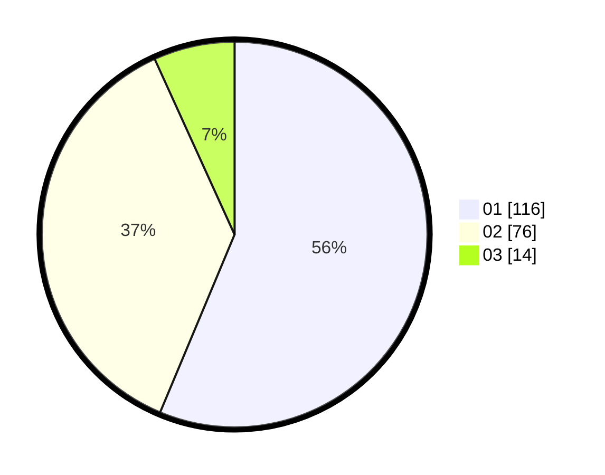

# Hasil

Hasil perolehan suara paslon dapat dilihat pada file paslon-01.txt, paslon-02.txt, dan paslon-03.txt.

Jika tidak ada, artinya data tersebut belum ada pada SIREKAP.

## Perolehan Suara

 * Paslon 01: **116**.
 * Paslon 02: **76**.
 * Paslon 03: **14**.

## Foto C Plano

https://sirekap-obj-formc.kpu.go.id/32cf/pemilu/ppwp/31/75/01/10/01/3175011001030-20240216-002153--2dc20b7e-0f38-464c-965a-c25019ecd77a.jpg

https://sirekap-obj-formc.kpu.go.id/32cf/pemilu/ppwp/31/75/01/10/01/3175011001030-20240216-002157--fa315429-0335-44fc-b722-9c8b5dcfda4d.jpg

https://sirekap-obj-formc.kpu.go.id/32cf/pemilu/ppwp/31/75/01/10/01/3175011001030-20240216-002155--28939b4a-09e7-46c1-ab37-7297435291f7.jpg

## DATA PEMILIH TETAP

Jumlah pemilih dalam DPT: **260**.
 * L: **124**.
 * P: **136**.

## DATA PENGGUNA HAK PILIH

Jumlah pengguna hak pilih dalam DPT: **205**.
 * L: **89**.
 * P: **116**.

Jumlah pengguna hak pilih dalam DPTb: **0**.
 * L: **0**.
 * P: **0**.

Jumlah pengguna hak pilih dalam DPK: **3**.
 * L: **0**.
 * P: **3**.

Jumlah pengguna hak pilih: **208**.
 * L: **89**.
 * P: **119**.

## JUMLAH SUARA SAH DAN TIDAK SAH

JUMLAH SELURUH SUARA SAH: **206**.

JUMLAH SUARA TIDAK SAH: **2**.

JUMLAH SELURUH SUARA SAH DAN SUARA TIDAK SAH: **208**.
