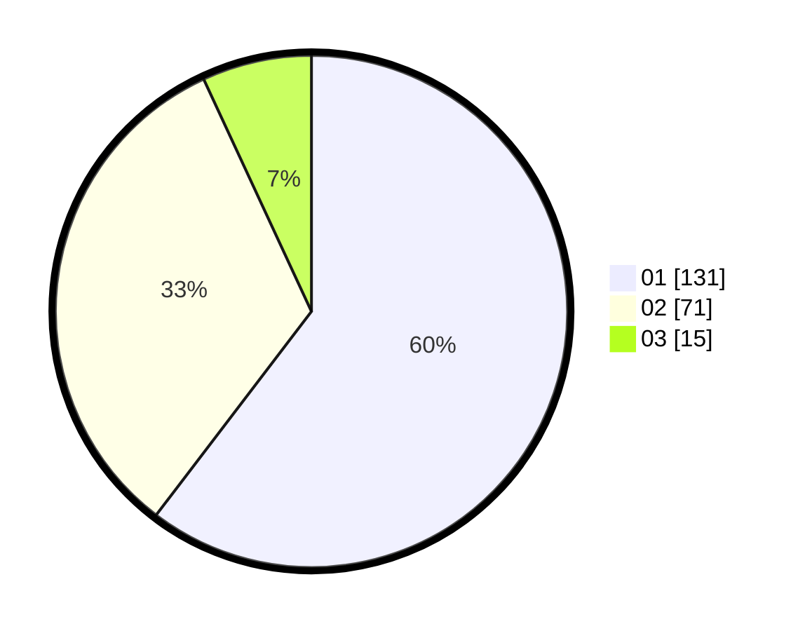

# Hasil

Hasil perolehan suara paslon dapat dilihat pada file paslon-01.txt, paslon-02.txt, dan paslon-03.txt.

Jika tidak ada, artinya data tersebut belum ada pada SIREKAP.

## Perolehan Suara

 * Paslon 01: **131**.
 * Paslon 02: **71**.
 * Paslon 03: **15**.

## Foto C Plano

https://sirekap-obj-formc.kpu.go.id/cf26/pemilu/ppwp/31/75/01/10/01/3175011001035-20240215-020908--74c683f2-f8f5-47f9-85e2-fb07a88836e8.jpg

https://sirekap-obj-formc.kpu.go.id/cf26/pemilu/ppwp/31/75/01/10/01/3175011001035-20240215-020112--f4f395c9-70ea-4988-ab5d-cb76b3a92984.jpg

https://sirekap-obj-formc.kpu.go.id/cf26/pemilu/ppwp/31/75/01/10/01/3175011001035-20240215-022012--b3fd653c-9d24-40e2-98c9-0636a07783d6.jpg

## DATA PEMILIH TETAP

Jumlah pemilih dalam DPT: **273**.
 * L: **133**.
 * P: **140**.

## DATA PENGGUNA HAK PILIH

Jumlah pengguna hak pilih dalam DPT: **214**.
 * L: **98**.
 * P: **116**.

Jumlah pengguna hak pilih dalam DPTb: **0**.
 * L: **0**.
 * P: **0**.

Jumlah pengguna hak pilih dalam DPK: **5**.
 * L: **2**.
 * P: **3**.

Jumlah pengguna hak pilih: **219**.
 * L: **100**.
 * P: **119**.

## JUMLAH SUARA SAH DAN TIDAK SAH

JUMLAH SELURUH SUARA SAH: **217**.

JUMLAH SUARA TIDAK SAH: **2**.

JUMLAH SELURUH SUARA SAH DAN SUARA TIDAK SAH: **219**.
