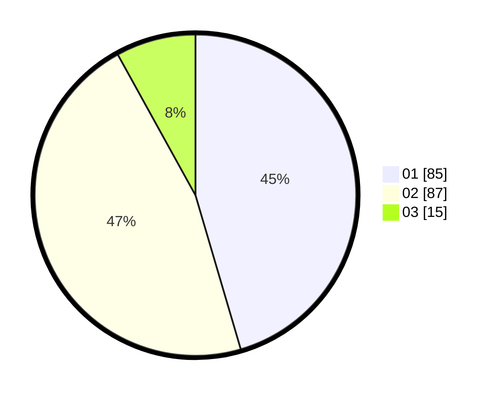

# Hasil

Hasil perolehan suara paslon dapat dilihat pada file paslon-01.txt, paslon-02.txt, dan paslon-03.txt.

Jika tidak ada, artinya data tersebut belum ada pada SIREKAP.

## Perolehan Suara

 * Paslon 01: **85**.
 * Paslon 02: **87**.
 * Paslon 03: **15**.

## Foto C Plano

https://sirekap-obj-formc.kpu.go.id/fad0/pemilu/ppwp/31/75/01/10/01/3175011001037-20240215-014313--143845fa-8fd5-4367-8cd0-2c9c23a08479.jpg

https://sirekap-obj-formc.kpu.go.id/fad0/pemilu/ppwp/31/75/01/10/01/3175011001037-20240215-014441--5ca99113-2162-4a76-9a73-4ef2c0f4884d.jpg

https://sirekap-obj-formc.kpu.go.id/fad0/pemilu/ppwp/31/75/01/10/01/3175011001037-20240215-014549--89b3a8cd-f36b-4161-ad4e-8420058daac0.jpg
