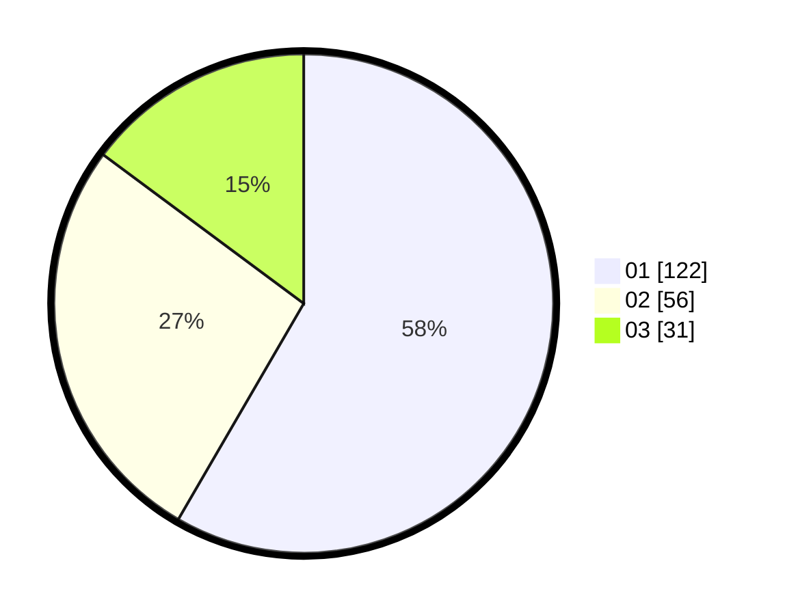

# Hasil

Hasil perolehan suara paslon dapat dilihat pada file paslon-01.txt, paslon-02.txt, dan paslon-03.txt.

Jika tidak ada, artinya data tersebut belum ada pada SIREKAP.

## Perolehan Suara

 * Paslon 01: **122**.
 * Paslon 02: **56**.
 * Paslon 03: **31**.

## Foto C Plano

https://sirekap-obj-formc.kpu.go.id/d43a/pemilu/ppwp/31/75/01/10/01/3175011001043-20240214-230711--2c6f16cc-0ec7-4a74-adb5-0caf57afa772.jpg

https://sirekap-obj-formc.kpu.go.id/d43a/pemilu/ppwp/31/75/01/10/01/3175011001043-20240214-230801--2a4a6ad5-7619-43ea-8a2d-f21e64a75f36.jpg

https://sirekap-obj-formc.kpu.go.id/d43a/pemilu/ppwp/31/75/01/10/01/3175011001043-20240214-230922--20050b20-78e7-4745-94cb-c55b9c4a8f68.jpg
