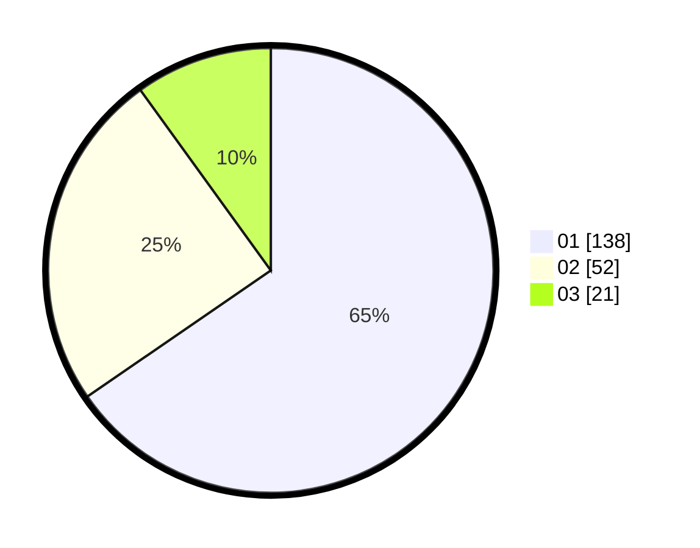

# Hasil

Hasil perolehan suara paslon dapat dilihat pada file paslon-01.txt, paslon-02.txt, dan paslon-03.txt.

Jika tidak ada, artinya data tersebut belum ada pada SIREKAP.

## Perolehan Suara

 * Paslon 01: **138**.
 * Paslon 02: **52**.
 * Paslon 03: **21**.

## Foto C Plano

https://sirekap-obj-formc.kpu.go.id/087f/pemilu/ppwp/31/75/01/10/01/3175011001045-20240214-235712--185858e9-239f-465a-bc38-645451a0c424.jpg

https://sirekap-obj-formc.kpu.go.id/087f/pemilu/ppwp/31/75/01/10/01/3175011001045-20240214-235843--c48e1565-b4fe-4774-bf54-bf4fd086d583.jpg

https://sirekap-obj-formc.kpu.go.id/087f/pemilu/ppwp/31/75/01/10/01/3175011001045-20240215-000002--60c8eef0-7fdd-4283-abc0-2b0f6ae54e85.jpg
