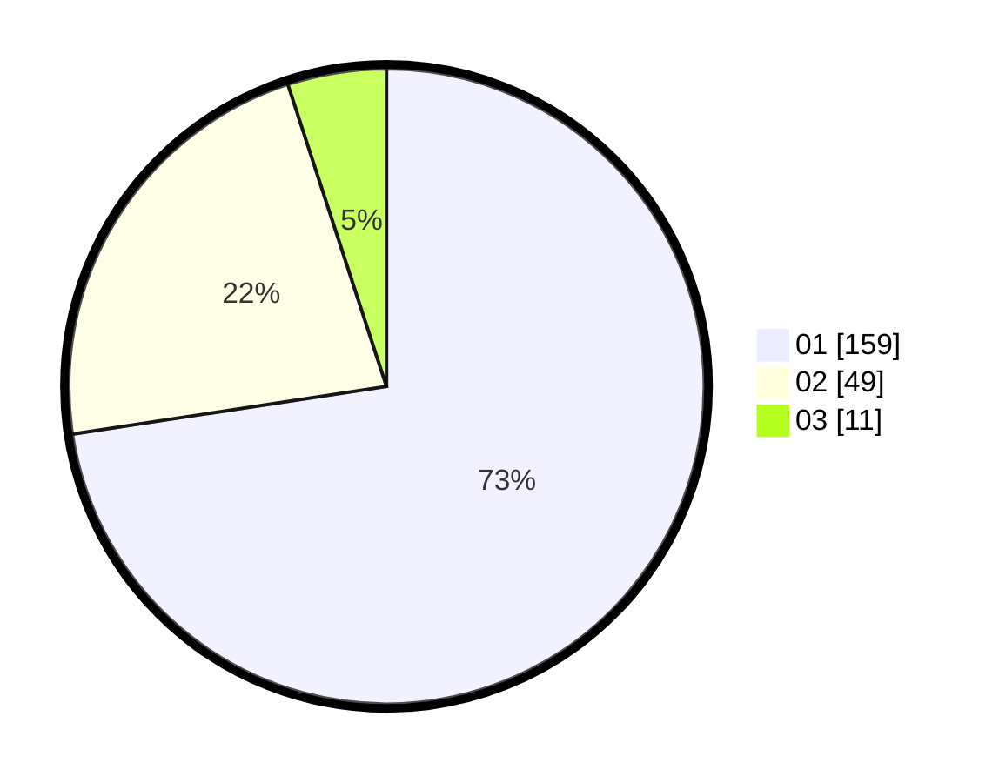

# Hasil

Hasil perolehan suara paslon dapat dilihat pada file paslon-01.txt, paslon-02.txt, dan paslon-03.txt.

Jika tidak ada, artinya data tersebut belum ada pada SIREKAP.

## Perolehan Suara

 * Paslon 01: **159**.
 * Paslon 02: **49**.
 * Paslon 03: **11**.

## Foto C Plano

https://sirekap-obj-formc.kpu.go.id/455e/pemilu/ppwp/31/75/01/10/01/3175011001046-20240215-000540--7323b0b0-721c-4dbd-871e-a83dc5ffe1a6.jpg

https://sirekap-obj-formc.kpu.go.id/455e/pemilu/ppwp/31/75/01/10/01/3175011001046-20240215-000642--763c6664-0b4e-4d46-9a75-06ba33da5bf3.jpg

https://sirekap-obj-formc.kpu.go.id/455e/pemilu/ppwp/31/75/01/10/01/3175011001046-20240215-000722--efdf661d-f055-4be8-9c93-d2e83568c9d7.jpg

## DATA PEMILIH TETAP

Jumlah pemilih dalam DPT: **263**.
 * L: **131**.
 * P: **132**.

## DATA PENGGUNA HAK PILIH

Jumlah pengguna hak pilih dalam DPT: **225**.
 * L: **109**.
 * P: **116**.

Jumlah pengguna hak pilih dalam DPTb: **0**.
 * L: **0**.
 * P: **0**.

Jumlah pengguna hak pilih dalam DPK: **1**.
 * L: **1**.
 * P: **0**.

Jumlah pengguna hak pilih: **226**.
 * L: **110**.
 * P: **116**.

## JUMLAH SUARA SAH DAN TIDAK SAH

JUMLAH SELURUH SUARA SAH: **219**.

JUMLAH SUARA TIDAK SAH: **7**.

JUMLAH SELURUH SUARA SAH DAN SUARA TIDAK SAH: **226**.
