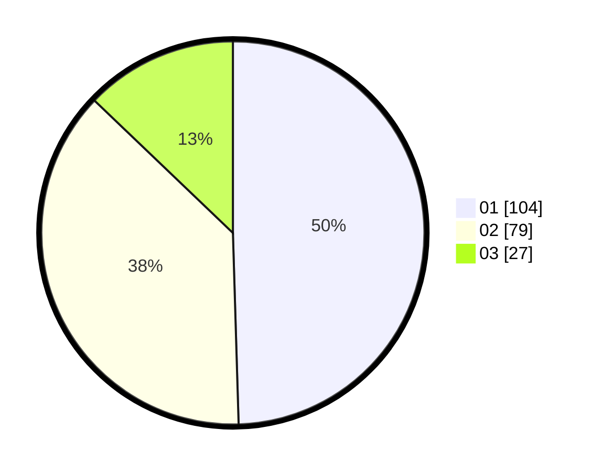

# Hasil

Hasil perolehan suara paslon dapat dilihat pada file paslon-01.txt, paslon-02.txt, dan paslon-03.txt.

Jika tidak ada, artinya data tersebut belum ada pada SIREKAP.

## Perolehan Suara

 * Paslon 01: **104**.
 * Paslon 02: **79**.
 * Paslon 03: **27**.

## Foto C Plano

https://sirekap-obj-formc.kpu.go.id/1077/pemilu/ppwp/31/75/01/10/01/3175011001047-20240215-030511--1240cf40-c4cd-4026-91c2-392153ef7b7e.jpg

https://sirekap-obj-formc.kpu.go.id/1077/pemilu/ppwp/31/75/01/10/01/3175011001047-20240215-030601--06565552-a5fe-4e72-ae1f-907613e9c5f4.jpg

https://sirekap-obj-formc.kpu.go.id/1077/pemilu/ppwp/31/75/01/10/01/3175011001047-20240214-231509--d13dc143-d303-49df-8f83-cb5c8b88c075.jpg
