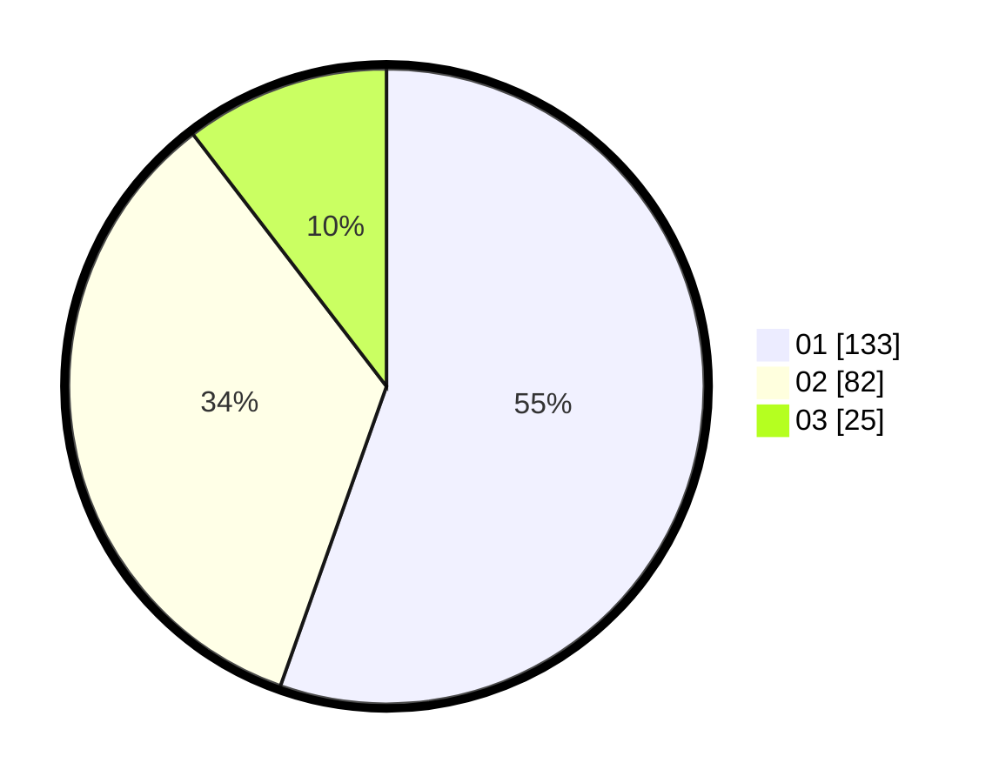

# Hasil

Hasil perolehan suara paslon dapat dilihat pada file paslon-01.txt, paslon-02.txt, dan paslon-03.txt.

Jika tidak ada, artinya data tersebut belum ada pada SIREKAP.

## Perolehan Suara

 * Paslon 01: **133**.
 * Paslon 02: **82**.
 * Paslon 03: **25**.

## Foto C Plano

https://sirekap-obj-formc.kpu.go.id/37e4/pemilu/ppwp/31/75/01/10/01/3175011001048-20240214-214704--d443c592-55cb-4485-a53f-c1b1db035c65.jpg

https://sirekap-obj-formc.kpu.go.id/37e4/pemilu/ppwp/31/75/01/10/01/3175011001048-20240214-215036--d9b828ea-7b97-406e-99de-c746308d4907.jpg

https://sirekap-obj-formc.kpu.go.id/37e4/pemilu/ppwp/31/75/01/10/01/3175011001048-20240214-214934--148faea0-5394-4e58-bfc8-4aae3fe3e7c9.jpg
