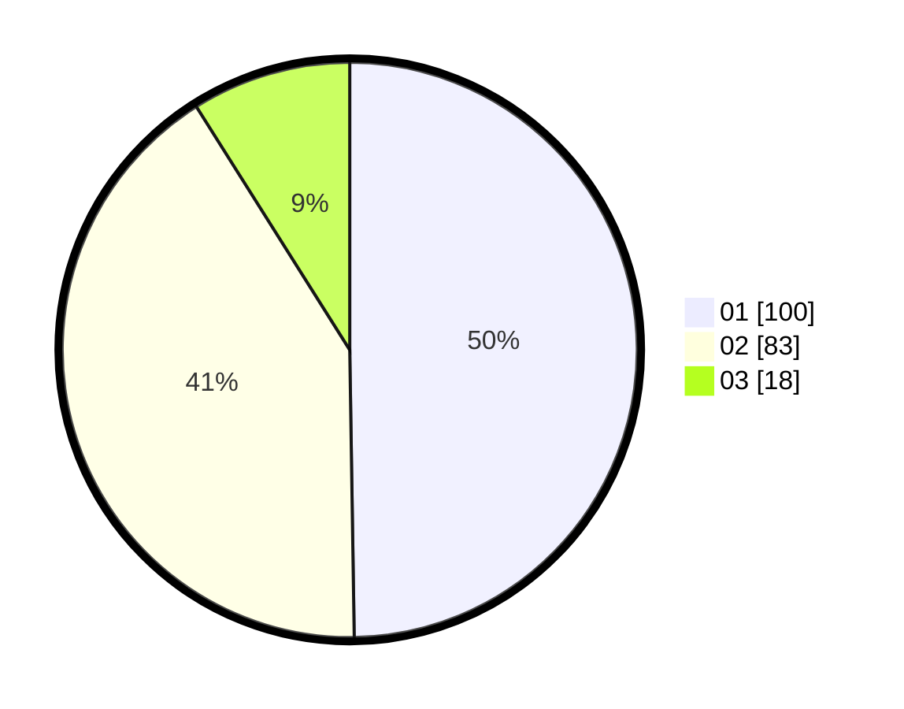

# Hasil

Hasil perolehan suara paslon dapat dilihat pada file paslon-01.txt, paslon-02.txt, dan paslon-03.txt.

Jika tidak ada, artinya data tersebut belum ada pada SIREKAP.

## Perolehan Suara

 * Paslon 01: **100**.
 * Paslon 02: **83**.
 * Paslon 03: **18**.

## Foto C Plano

https://sirekap-obj-formc.kpu.go.id/ce90/pemilu/ppwp/31/75/01/10/01/3175011001051-20240215-005354--9e3145ca-d05b-4601-8abf-f0935b6ab9b3.jpg

https://sirekap-obj-formc.kpu.go.id/ce90/pemilu/ppwp/31/75/01/10/01/3175011001051-20240215-012921--37401d52-c7bc-4f09-91e0-5f0346bd0bd6.jpg

https://sirekap-obj-formc.kpu.go.id/ce90/pemilu/ppwp/31/75/01/10/01/3175011001051-20240215-010315--c38e6540-fd7b-4ca1-9b08-ba07ddd57bd9.jpg
